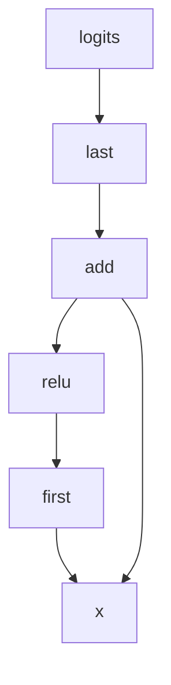
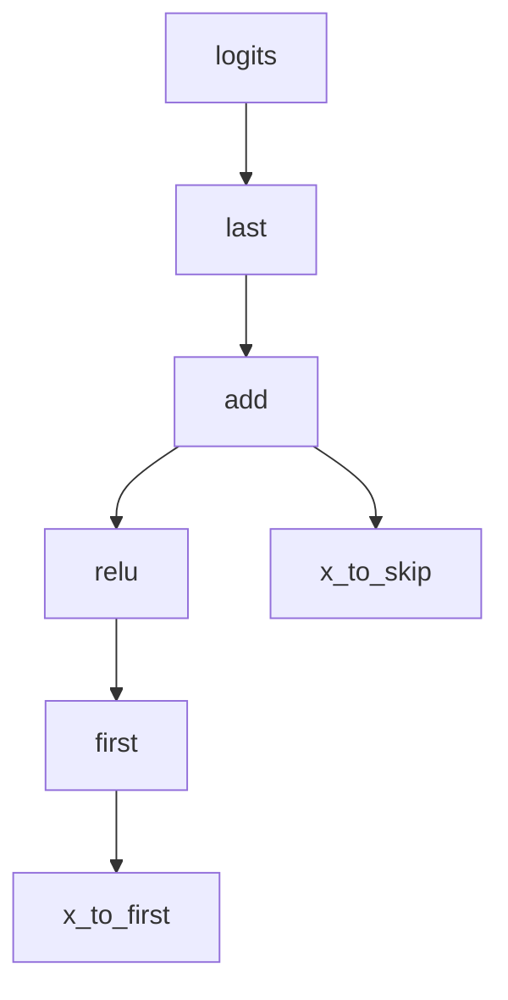
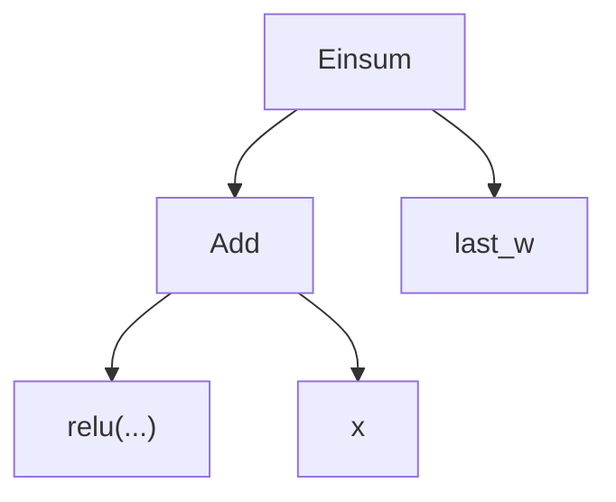
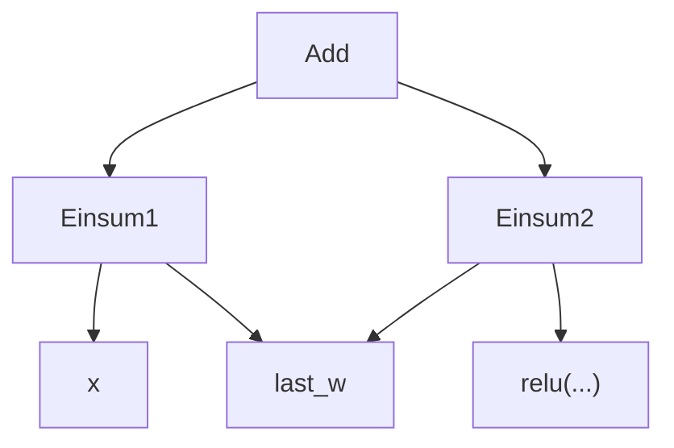

# REMIX Day 1 - Intro to Circuits

Today you'll implement a simplified version of Redwood's library Circuits and understand the key differences between our approach and other methods based on PyTorch hooks.

You'll use your library to investigate the behavior of two simple neural networks trained on the classic MNIST dataset.

Both networks are identical in architecture, train to approximately human level accuracy in a couple seconds, and generalize well to the test set.

Should we expect their internal machinery to implement basically equivalent algorithms with minor differences due to random initialization, or is it possible that they both answer the same examples correctly for different "reasons"?

## Table of Contents

- [Learning Objectives](#learning-objectives)
- [Setup](#setup)
- [A Note on Test Coverage](#a-note-on-test-coverage)
- [Getting Started](#getting-started)
- [Model Definition](#model-definition)
- [MNIST](#mnist)
    - [TensorDataset](#tensordataset)
    - [Crash Course on the `attrs` library](#crash-course-on-the-attrs-library)
    - [attrs.evolve](#attrsevolve)
    - [Really modifying (mutating) frozen objects](#really-modifying-mutating-frozen-objects)
- [Data Visualization](#data-visualization)
    - [Confusion Matrix](#confusion-matrix)
- [Intro to Composable UI](#intro-to-composable-ui)
- [Visualizing Weights](#visualizing-weights)
- [Reading Intermediates](#reading-intermediates)
    - [Manual Editing](#manual-editing)
    - [Hooks](#hooks)
- [Zero Ablation with Hooks](#zero-ablation-with-hooks)
    - [Results of Zero Ablation](#results-of-zero-ablation)
- [Mean Ablation](#mean-ablation)
    - [Results of Mean Ablation](#results-of-mean-ablation)
    - [Mean Ablation - Limitations](#mean-ablation---limitations)
- [Resampling Ablation](#resampling-ablation)
    - [Resampling Ablation - results](#resampling-ablation---results)
- [Path Patching](#path-patching)
    - [Limitations of Hooks](#limitations-of-hooks)
- [Introducing the Circuits library](#introducing-the-circuits-library)
    - [Desiderata](#desiderata)
- [Build Your Own Circuits](#build-your-own-circuits)
    - [Circuit Names](#circuit-names)
    - [Circuit Shape](#circuit-shape)
    - [Circuit Traversal](#circuit-traversal)
    - [Array](#array)
    - [Add](#add)
    - [Relu](#relu)
- [Einsum](#einsum)
    - [Parsing einsum strings](#parsing-einsum-strings)
    - [Einsum Class](#einsum-class)
    - [Fancy Einsum](#fancy-einsum)
- [Scalar](#scalar)
    - [Scalar Multiplication Without Multiply](#scalar-multiplication-without-multiply)
    - [Elementwise Multiplication](#elementwise-multiplication)
    - [Subtraction Without Subtract](#subtraction-without-subtract)
- [Basic Tree Printing](#basic-tree-printing)
- [Model Assembly!](#model-assembly)
- [Matchers and Locating Nodes](#matchers-and-locating-nodes)
- [A general Matcher class](#a-general-matcher-class)
- [Matcher](#matcher)
    - [Beyond Matcher](#beyond-matcher)
- [Circuit Updates](#circuit-updates)
    - [Updater class](#updater-class)
    - [`functools.partial`](#functoolspartial)
- [Batching in Circuits](#batching-in-circuits)
    - [Updaters and Unwrap](#updaters-and-unwrap)
    - [Using batched circuits](#using-batched-circuits)
    - [Matcher-Updater Pairing](#matcher-updater-pairing)
- [Adapter](#adapter)
- [Zero Ablation - the Circuits way](#zero-ablation---the-circuits-way)
- [Mean Ablation - the Circuits way](#mean-ablation---the-circuits-way)
- [Resampling Ablation - the Circuits way](#resampling-ablation---the-circuits-way)
- [Path Patching Revisited](#path-patching-revisited)
    - [Path Patching - Results](#path-patching---results)
- [More Complex Paths and IterativeMatcher](#more-complex-paths-and-iterativematcher)
    - [IterativeMatcherDataPlain](#iterativematcherdataplain)
    - [IterativeMatcherDataFilter](#iterativematcherdatafilter)
- [Optional - Chain IterativeMatcher](#optional---chain-iterativematcher)
- [Updater - full version](#updater---full-version)
- [Path Patching 3 - With IterativeMatcher](#path-patching----with-iterativematcher)
- [Introduction to Algebraic Rewrites](#introduction-to-algebraic-rewrites)
- [The Residual rewrite](#the-residual-rewrite)
- [Floating Point Numbers](#floating-point-numbers)
- [Index Nodes](#index-nodes)
    - [Slices](#slices)
    - [Index - Shape Computation](#index---shape-computation)
    - [Index class](#index-class)
- [Push-Down Index Rewrite](#push-down-index-rewrite)
- [Into the Unknown!](#into-the-unknown)

## Learning Objectives

After today's material, you should be able to:

- Explain the differences between hooks and Circuits
- Write computational graphs using the various `Circuit` subclasses
- Match nodes and paths using various crtieria
- Explain the concept and uses of graph rewrites

## Setup
Make sure you have the following installed:

`conda run -n remix pip install torchvision==0.12 --no-deps`

`conda run -n remix pip install jupyter ipywidgets scikit-learn fancy_einsum`

In VS Code, we recommend you have word wrap enabled (View -> Word Wrap).

We also recommend you leave the Explorer pane on the left closed to maximize screen real estate, and open files as needed with Command-P or Ctrl-P. Finally, set your font size to one appropriate for your monitor: Command-Shift-P (or similar) opens the Command Palette, then type "font" to see available commands.

## A Note on Test Coverage

We have provided some unit tests to help you get through the material faster and reduce the amount of time stuck on bugs. These tests are *not* intended to be exhaustive and passing all tests does not definitely prove that your code is correct.

When you are doing research, you'll have to write your own unit tests, so it's good practice to get into the habit of writing additional test cases as needed. In particular, when you encounter issues you should get into the habit of considering whether earlier code could be broken in ways that earlier tests didn't detect.

I also recommend using assertions liberally throughout the exercises. I frequently assert that shapes and types are as expected, and that preconditions and postconditions are maintained.

## Getting Started

Copy the following code block into a new file, and ensure you're on an appropriate branch like `remix_d1/chris-and-max` (see the README if you don't know how to do this).


```python
from __future__ import annotations
import os
import sys
import inspect
import itertools
import os
import re
import string
import sys
from abc import ABC, abstractmethod
from functools import partial
from typing import Any, Callable, Iterable, Literal, Optional, Sequence, Type, Union, cast
import attrs
import pandas as pd
import seaborn as sns
import torch
import torch as t
import torch.nn as nn
import torch.nn.functional
import fancy_einsum
from attrs import evolve
from einops import rearrange, repeat
from matplotlib import pyplot as plt
from torch.utils.data import TensorDataset
from tqdm.notebook import tqdm
import remix_utils

pd.set_option("display.precision", 3)
MAIN = __name__ == "__main__"

```

## Model Definition

We'll be starting with a very simple architecture, with about 600K parameters. Read the model definition and make sure you understand the flow of data - making your own diagram may be helpful.

Each input is a grayscale image 28 pixels wide and 28 pixels high, and is represented as a flat vector of 28*28 floats.

The output of the model is 10 logits, one for each possible digit.

Exercise: what is `model_a.last.weight.shape`? What is the equation for the computation that happens when you run `model_a.first(x)`? If you don't know offhand, review [the official docs on Linear](https://pytorch.org/docs/stable/generated/torch.nn.Linear.html).

<details>

<summary>Solution</summary>

The weight of a Linear is `(out_features, in_features)`, which may be the reverse of what you expect.

The equation is $y = x @ weight^T + bias$.

The method behind this madness? Each output element is a dot product between a row of the first operand and a column of the second operand.

If the Linear weight was stored as `(in_features, out_features)`, then data for a column would be scattered through memory. This trick makes the data for a column contiguous, improving speed.

</details>


```python
class TwoLayerSkip(nn.Module):
    """Model with two Linear layers and a skip connection that bypasses the first linear-relu section."""

    def __init__(self):
        super().__init__()
        self.first = nn.Linear(28 * 28, 28 * 28, bias=True)
        self.last = nn.Linear(28 * 28, 10, bias=True)

    def forward(self, x: t.Tensor) -> t.Tensor:
        skip = x.clone()
        skip += torch.nn.functional.relu(self.first(x))
        return self.last(skip)


model_a = TwoLayerSkip()
model_a.load_state_dict(t.load("./remix_d2_data/model_a.pickle", map_location=torch.device("cpu")))
model_b = TwoLayerSkip()
model_b.load_state_dict(t.load("./remix_d2_data/model_b.pickle", map_location=torch.device("cpu")))
models = [("A", model_a), ("B", model_b)]

```

## MNIST

The details of the dataset are always important in ML. In a moment, we'll use Redwood's composable UI to explore the dataset. Some basic facts you should know:

- Each of the image shows a handwritten digit from 0-9 centered in the frame.
- These data have already been normalized to mean 0 and standard deviation 1.
- Human level performance on this data is around 97-99%. The reasons it's not higher are that a small number of images are too ambiguously written, and some images can correctly be classified by humans, but the label in the dataset is mistaken so this is (incorrectly) treated as a wrong prediction.

### TensorDataset

`train_dataset` and `test_dataset` are instances of the PyTorch class `TensorDataset`. Indexing into the `TensorDataset` returns a tuple of (image, label), and the `tensors` field gives access to the full tensors.

Run the code below to view some example images.


```python
(train_dataset, test_dataset) = remix_utils.get_mnist()
(test_inputs, test_labels) = test_dataset.tensors


def plot_img(img: t.Tensor):
    arr = img.detach().cpu().numpy()
    (fig, ax) = plt.subplots()
    axes_img = ax.imshow(arr.reshape(28, 28), cmap="gray_r")
    fig.colorbar(axes_img)
    return fig


for i in range(3):
    (img, label) = train_dataset[i]
    fig = plot_img(img)
    fig.suptitle(f"Ground truth label: {label.item()}")

```

### Crash Course on the `attrs` library

We use the [`attrs`](https://www.attrs.org/en/stable/index.html#) library for many of the classes in Circuits. `attrs` is similar to the standard library `dataclasses` but has more features, which we'll introduce as they become important.

For today, you'll need to know that when we use `@attrs.define`, various things including a constructor, a string representation, and an equality operator are automatically generated. Equality is defined as all the corresponding fields being equal.

When we use `frozen=True`, trying to assign to the object's fields will raise an exception. One benefit of using frozen objects is that multiple places can hold a reference to the same frozen object without worrying about changes in one place affecting the other.

Exercise: try assigning to `a.x`.

- Verify that your IDE's static typechecking shows this as an error with a helpful message such as "Cannot assign member "x" for type "Point3d".
- Verify that when you run the assignment, `FrozenInstanceError` is raised at runtime.

<details>

<summary>Help - the VSCode checker isn't seeing my assignment as an error!</summary>

In the command palette, choose "Preference: Open Workspace Settings (JSON)" and ensure that you have an entry like "python.analysis.typeCheckingMode": "basic".

If this still doesn't work, call a TA as this day will be significantly harder without being able to rely on the type checker.

</details>


```python
@attrs.define(frozen=True)
class Point3d:
    x: float
    y: float
    z: float


pa = Point3d(1.0, 2.0, -3.0)
pb = Point3d(1.0, 2.0, -3.0)
pc = Point3d(1.0, 2.0, -4.0)
print("Two objects defined via attrs are equal iff all their fields are equal:")
print("a == b", pa == pb)
print("a == c", pa == pc)

```

### attrs.evolve

If you want to "modify" a frozen object, what you'll actually do is create a new object with new values for some of the fields.

This isn't bad with only 3 fields in our example, but it's cumbersome when you have many fields, so `attrs` provides a method called `evolve` that lets you specify only the changed fields and copies the rest.


```python
a_flipped = Point3d(-pa.x, pa.y, pa.z)
a_flipped_2 = evolve(pa, x=-pa.x)
print("Two ways to do the same thing: ", a_flipped, a_flipped_2)

```

### Really modifying (mutating) frozen objects

A statement like `a.x = 5.0` actually calls `Point3d.__setattr__(a, 'x', 5.0)`, which has been implemented by `attrs` so that it raises an exception.

Later, we'll legitimately need to modify frozen objects (to initialize them properly), and we can do so by calling `object.__setattr__(a, 'x', 5.0)` instead.

## Data Visualization

The next thing we'll want to do is be able to run our model and inspect its performance.

Quick note on terminology: "performance" can be ambiguous and refer to:
- The model's competence for some (loss function, dataset) pair
- The number of floating point operations required to run the model
- The wall clock time needed to run the model

For the model's competence, it's best to be verbose and spell out "accuracy on the test set" or similar, as the exact details do matter for our experiments.

The exact details of FLOPS vs wall time are much less important, so I'll loosely say "speed" to refer to them.

Since the data is small, we'll run the entire test set in one large batch of size 10,000 for simplicity. We're running on CPU by default, just to avoid having to move tensors between devices.

This code is provided for you since it's very routine stuff.


```python
@attrs.define(frozen=True, eq=False)
class TestResult:
    loss: float
    acc: float
    logits: t.Tensor
    incorrect_indexes: t.Tensor


results: dict[tuple[str, str], TestResult] = {}


def show_results():
    rows = []
    for ((exp_name, model), result) in results.items():
        rows.append((exp_name, model, result.loss, result.acc))
    return pd.DataFrame.from_records(
        rows, columns=["experiment", "model", "test_loss", "test_acc"], index=("experiment", "model")
    )


def test(model: nn.Module, dataset: TensorDataset, device: Union[str, t.device] = "cpu") -> TestResult:
    model.eval()
    model.to(device)
    all_incorrect_indexes = []
    (data, target) = dataset.tensors
    (data, target) = (data.to(device), target.to(device))
    with torch.inference_mode():
        logits = model(data)
        test_loss = torch.nn.functional.cross_entropy(logits, target, label_smoothing=0.1).item()
        pred = logits.argmax(dim=1)
        correct = pred == target
        all_incorrect_indexes.append((~correct).nonzero().flatten())
    return TestResult(
        loss=test_loss,
        acc=correct.sum().item() / len(dataset),
        logits=logits,
        incorrect_indexes=t.cat(all_incorrect_indexes),
    )


for (name, model) in models:
    results["baseline", name] = result = test(model, test_dataset)
show_results()

```

### Confusion Matrix

Let's also look at the confusion matrix.

Exercise: Which digits are misclassified most often?


```python
from sklearn.metrics import confusion_matrix

logits_a = results["baseline", "A"].logits
logits_b = results["baseline", "B"].logits
(fig, axes) = plt.subplots(figsize=(5, 10), nrows=2)
for ((name, model), ax, logits) in zip(models, axes, [logits_a, logits_b]):
    mat = confusion_matrix(test_labels, logits.argmax(dim=-1))
    for i in range(10):
        mat[i, i] = 0
    sns.heatmap(mat, ax=ax, vmax=18)
    ax.set(xlabel=f"Model {name} Prediction", ylabel="True class")

```

## Intro to Composable UI

The composable UI (CUI) is Redwood's internal tool for visualizing multi-dimensional tensors in a web frontend.

It allows us to visualize one or more tensors with meaningful labels on each dimension and position.

You can switch between different charts without having to write additional code, and you can "link" together different charts.

Code-wise, CUI has two parts: a frontend written in React that runs on a web server, and a backend which runs in your Python kernel.

When you open your browser to the frontend web page, your browser will try to communicate with the backend over a specific port, which defaults to 6789. If you're running over SSH, then you need to also forward the port to the remote machine.

In VSCode, there's a tab "Ports" which you can click, then "Add Port" -> 6789. VSCode should remember this for future sessions. (The "Ports" tab will only be present when you are connected to the remote host.)

You don't have to understand anything about the `await` keyword here, and you can ignore the type-checker's complaint - it doesn't know that we're running this in a "notebook".

There's definitely a learning curve to this tool. Some things you can try to start:


- Change the "example" dimension from "axis" to "facet". This will render a separate plot for each example image.
- The default chart type is set up for text; change the chart type to "Tiny matrix". This will allow you to see the images in a natural form. Which "mistakes" of the model do you think are not really mistakes? Can you find an instance where the preprocessing didn't work correctly?
- Using "Sided matrix" instead of "Tiny matrix" will display axes labels and will also let you see the values of the tensor's entries on hover.
- Click "Add new plot", then go to the bottom and set Plot 1 to "logits" to view that tensor.
- In Plot 1, set the chart type to "Sided matrix" and set the model dimension to "facet". For the same example, in what ways are the logits different across the two models?

Note that the selections you've made are saved in the URL. If the tool crashes or you want to save your selections for later, you can copy the URL.


```python
from interp import cui
from interp.ui.very_named_tensor import VeryNamedTensor

remix_utils.await_without_await(lambda: cui.init(port=6789))
idx = (
    (
        ((logits_a.argmax(-1) != 4) | (logits_b.argmax(-1) != 4))
        & ((logits_a.argmax(-1) == 9) | (logits_b.argmax(-1) == 9))
        & (test_labels == 4)
    )
    .nonzero()
    .flatten()
)
vnt_incorrect = VeryNamedTensor(
    test_inputs[idx].reshape(-1, 28, 28),
    dim_names="example height width".split(),
    dim_types="example seq seq".split(),
    dim_idx_names=[idx.tolist(), range(28), range(28)],
    title="4s misclassified as 9s by at least one model",
)
vnt_logits = VeryNamedTensor(
    t.stack([logits_a[idx], logits_b[idx]], dim=0),
    dim_names="model example pred".split(),
    dim_types="model example seq".split(),
    dim_idx_names=[["A", "B"], idx.tolist(), range(10)],
    title="logits",
)
remix_utils.await_without_await(lambda: cui.show_tensors(vnt_incorrect, vnt_logits))

```

## Visualizing Weights

Exercise: create a `VeryNamedTensor` for `first_weights` and `last_weights`, then take up to 5 minutes to visualize them in the CUI. Can you discover anything interesting?

<details>

<summary>Does it matter what dim_type I use?</summary>

You can use "seq" as a `dim_type` to let CUI know that this axes is sequential (ordered integers). This is used to recommend appropriate visualizations. For the model dimension, they aren't really ordered so you can use any string you want and nothing special will happen.

</details>

<details>

<summary>Spoiler - things to see</summary>

Looking at the last layer weights with Tiny Matrix (or Sided Matrix) and the model and logit dimensions set to facet, you can clearly see digit patterns in Model B but not in Model A.

Looking at the first layer weights with Tiny Matrix and the model and output dimensions set to facet, Model B's first layer is much more sparse. Many of the feature maps are empty or nearly empty, meaning the first layer doesn't write anything to that output pixel.

</details>


```python
first_weights = t.stack([model.first.weight.detach().reshape(784, 28, 28) for (_, model) in models], dim=0)
last_weights = t.stack([model.last.weight.detach().reshape(10, 28, 28) for (_, model) in models], dim=0)
vnt_first: VeryNamedTensor
vnt_last: VeryNamedTensor
"TODO: YOUR CODE HERE"
remix_utils.await_without_await(lambda: cui.show_tensors(vnt_first, vnt_last))

```

Optional: Use the Composable UI to further investigate the examples that the models get wrong.

Show:
- All misclassified test set examples
    - Can we include the wrong logits beside this?
- A random sample grouped by digit (digit, height, width)
    - Facet on digit
    - Check out what the mean digit looks like
- Can we see the variance of each pixel? This is interesting because there are some zero variance pixels.

See [here](https://www.youtube.com/watch?v=zH8YBqdIB-w) for Max's video demo of the Composable UI.


## Reading Intermediates

One of the most common tasks we want to do in interpretability is examine and modify intermediate `Tensor`s computed during the forward pass.

Ideally, our tooling would allow us to pick any `Tensor` in the computation we care about and operate on it generically.

Specifically, in this architecture's forward pass there are three intermediate `Tensors` computed by PyTorch.

Exercise: what are they?

<details>

<summary>Solution - intermediates</summary>

The intermediates accessible from Python are:

1) Output of `first` (same as the input of `relu`)
2) Output of `relu`
3) Output of skip aka `relu` + input (same as the input of `last`)

</details>

If you wrote out the algebraic equations for the calculation in terms of matrices, there are two more terms we haven't considered yet. In the actual PyTorch implementation, these terms don't exist as independent objects - I'll call this sort of tensor a "hidden temporary" or just "temporary".

Exercise: what are the two hidden temporaries?

<details>

<summary>Solution - temporaries</summary>

Each `Linear` layer does a matrix-multiply by the weight, which the docs refer to as `xA^T`.

This temporary is added to the bias to produce the output of the Linear. The actual `Linear` implementation does the matmul and the add in one atomic step, without ever creating a `torch.Tensor` with the contents `xA^T`.

</details>


### Manual Editing

One thing you could do is just duplicate and edit the model definition directly whenever you want to do an experiment. This is a thing that people do, and has the advantage of being very explicit about what's happening and easy to understand. Unfortunately, it's quite difficult to maintain many copies of the model code and the edits can be error prone. We don't recommend this approach.

### Hooks

PyTorch provides a cleaner way to inspect and modify your model that doesn't require editing your model definition every time, called hooks [(official docs)](https://pytorch.org/docs/stable/generated/torch.nn.Module.html?highlight=nn%20module#torch.nn.Module.register_forward_hook).

This brief introduction to hooks is mainly beneficial because I expect you to have to read other peoples's code that uses them; our claim is that our library for circuits (called Circuits from here on) can do everything hooks can do and more.

A hook is a user-defined function registered to a specific `nn.Module` by calling the `register_forward_hook(hook)` method on that module. Later, when the `forward` method of that module is run, the hook is called with three arguments: the module, a tuple of positional inputs, and its output. Your user-defined function can then do whatever it wants.

To allow you to disable the hook, `register_forward_hook` returns a `handle` object, which allows you to call `handle.remove()` which just unregisters the hook from the module. The benefit here is you can run various experiments against one model definition.

Exercise: Implement `plot_img_hook` and register it on the `last` layer, so that it calls `plot_img` on the input to `last` when called. Run both models on an input example such as `img`. What do you see?

<details>
<summary>Help! My hook is stuck on a module and I don't have access to the handle to remove it, possibly because my code threw an exception.</summary>

Sadly, this happens all the time when using hooks. The hooks are stored in a dictionary called `_forward_hooks`, so you can clear this to manually remove them. `remix_utils.remove_all_hooks(module)` is also provided as a helper function to do this.

</details>


```python
def plot_img_hook(module: nn.Module, input: tuple[t.Tensor, ...], output: t.Tensor) -> None:
    """Plot an image, assuming the module takes the image Tensor as the single positional argument."""
    "TODO: YOUR CODE HERE"
    pass


"Run the model here."

```

## Zero Ablation with Hooks

We could use CUI to look at a lot of activations in this way to get a better picture, but we're going to speedrun through hooks instead.

One intervention that's easy and quick to run is to replace the first layer's activation (output of the ReLU) with zero and see what happens to the loss.

If we think about a specific neuron in the first layer, it might be the case that the neuron detects some pattern such as a vertical stripe using a weighted sum of pixels. The bias of the neuron can be set to a negative value such that if the stripe isn't sufficiently present, the ReLU clamps the neuron output to zero, otherwise the neuron starts to activate (providing increasing evidence for a 1 digit). Under this theory, if we set all the neuron outputs to zero, this is like disabling the information flow through the first layer by turning all the neurons to the "feature not sufficiently present" state.

This was a hand-waving argument and we would need to do more observations and carefully justify the conditions before this would be valid. A hazard of zero ablation is that it's very easy to do it even when it isn't valid and the results don't really mean anything. For now, let's just practice using hooks and run the experiment.

There are two ways to modify the output: if the return value of a hook is not `None`, the return value will replace the output of the hooked module. I generally prefer this way, but it's also fine to modify the `output` argument in-place.

Exercise: evaluate each model on the test set again, but with the first layer activations set to zero. How is the loss affected?

<details>

<summary>I'm confused about how to do this!</summary>

A limitation of hooks is that you can only hook `nn.Module` instances. A correct but tedious option is to go through and change the model definition to use `nn.ReLU()` instead of the functional form. It's easier to register a hook on the `first` module and modify the output there to be 0. Since relu(0) = 0, this achieves the goal.

</details>


```python
def zero_ablate_hook(module: nn.Module, input: tuple[t.Tensor, ...], output: t.Tensor) -> t.Tensor:
    """Return a zero tensor with the same shape and dtype as output."""
    "TODO: YOUR CODE HERE"
    pass


'Register zero_ablate_hook, run test, and store the results in `results[("zero", model_name)]`.'
show_results()

```

### Results of Zero Ablation

Model A's accuracy dropped to near random chance, while Model B's accuracy only dropped somewhat.

This suggests a hypothesis that Model A doesn't use the skip connection much and prefers to use features calculated by the first layer, while Model B substantially uses the input pixels directly via the skip. You may also have seen supporting evidence for this in the CUI weight visualization.

It might be tempting to treat this large effect size as strong evidence that we're measuring something real here. However, it might be more likely that zero ablation wasn't appropriate here and this experiment doesn't mean much. Again, let's keep moving and practice further with hooks.

## Mean Ablation

Another easy and almost as quick intervention is to replace the activation with the mean activation over some dataset. Here's a sketch of why mean ablation could be better than zero ablation:

Suppose you have a neuron in the first layer whose weights are all zero and whose bias is +2. Since `relu` is the identity for positive inputs, this neuron always outputs +2. Neurons in later layers are able to learn that this neuron is a constant feature and depend on it. For example, a neuron that "needs" a bias of +1 could either achieve this by setting a weight of 0.5 to the constant feature and leaving its own bias at 0.

Zero ablating this constant +2 activation will increase our loss, but this isn't actually corresponding to the notion of "disabling information flow" that we hoped for. Mean activation will set the activation to +2 which is intuitively sensible.

This argument is also hand-waving and again, it's easy to do mean ablation when it doesn't actually produce valid evidence; we'll cover this with more rigor later.

Exercise: suppose we want to perform mean ablation on the first layer's activation (after the ReLU). How easy is this to do?

<details>

<summary>Spoiler</summary>

We were able to just hook `first` for zero ablation and this was the same as hooking after the ReLU since `relu(0) == 0`. For mean ablation this usually doesn't work, except we only have one batch, so you can do something similar...

If we think about the mean of one element in the tensor, it's a scalar `1/N sum (relu(x_i))`, where N is the number of training examples and i is [0..N).

We can compute this formula by hooking before the ReLU to get `x_i`, manually applying the ReLU inside the hook to get `relu(x_i)`, and summing that.

</details>

Exercise: perform mean ablation on the first layer output (after the ReLU). Take the mean over the full test set.

<details>

<summary>I'm confused about how to do this!</summary>

Normally you would need two hooks and would need to do a first pass to compute the mean, followed by a second pass to replace the output of the ReLU with the stored mean. But we only have one batch so can do everything in the same hook.

Hook `first`, compute the `ReLU` manually, and calculate the mean as described in the Spoiler. The `relu` function has the property that `relu(relu(x)) = relu(x)` so it's okay that the output of the first layer already has the `relu` applied.

Ensure that the mean has the same shape as what it's replacing.

</details>


```python
'Your experiment here. Store the results in `results[("mean", model_name)]`'
show_results()

```

### Results of Mean Ablation
You should observe that the performance of model A drops to around 39%, while that of model B drops to around 87%.

### Mean Ablation - Limitations

The computational cost of mean ablation is higher than zero ablation, but the mean computation only has to be done once per model-dataset pair and then you can save the mean to disk and reuse it easily in different experiments.

A bigger issue is that the mean activation might be very different from the notion of a "typical" activation. Say that a first layer neuron outputs +1 when the feature it detects is not present, and +5 when the feature is present. If the feature is present in 50% of the dataset examples, the mean activation is (1+5)/2 = +3.

If we have a later neuron with a weight of 1 and bias of -1, then when we are running real examples this neuron outputs 0 when the first feature is absent, and +4 when it's present. Running on the mean, it outputs +2 all the time.

Intuitively, the idea of mean ablation is to set activations to a "typical" value, but in this example the mean of a bi-modal distribution can be very atypical and in fact the later neuron would never output +2 on real data.

## Resampling Ablation

Hopefully it should seem natural at this point to try replacing intermediates not with zero or the mean, but with the intermediates from some other dataset example. One advantage of this is that it's valid anywhere in the network, whereas our hand-waving arguments for the other ablations relied on facts about relu.

The effect of this will be noisy and random, but by doing it repeatedly we can hope to get results that are more representative.

The full setup for resampling ablation is a bit finicky, so let's do a simplified version now.

Exercise: for each model, perform resampling ablation on the output of `first` (before the relu). That is, for each example, the output is replaced by that from a randomly chosen (with replacement) example. Run the ablation 3 times - does the result vary much?

<details>

<summary>I'm confused about how to do this!</summary>

Run the test set with a hook that appends first layer activations to a list. Concatenate the list into one big tensor.

Then, run the test set again with a hook that uses `torch.randint` to generate the indexes to select.

</details>


```python
"Your experiment here"
show_results()

```

### Resampling Ablation - results

I found that the results were very consistent between random runs. A's accuracy dropped to around 12%, and B's accuracy dropped to around 70%. If your numbers are more than a few percent off of this, it's probably a bug.

Resampling ablation did support our initial hypothesis that there's a difference between models in how important the first layer features are.

## Path Patching

Next, suppose we want to ablate in some way just the pixel information passing through the skip connection, while leaving the first layer input alone. Our hypothesis predicts that we would observe the reverse effect of the first experiment: model A should preserve its ability, while model B should lose performance. If we observe something else, this is even more valuable as it might suggest that our code has a bug or that the behavior is more complex than it appears.

Conceptually, our computation tree currently has one instance of the pixel data `x`:


(Computation trees are often drawn with the arrows the other way round. Here, we're using the convention that arrows go from nodes to their inputs.)

(If you can't see this diagram in VS Code, either look at it on GitHub, or install the "Markdown Preview Mermaid Support" extension and reload your window.)

But we want to counterfactually think about what would happen if we only changed one of the "paths" by which `x` affects the logits. Conceptually, this looks like a tree where the `x` are different:



### Limitations of Hooks

In our current setup, running this experiment is troublesome. We can only replace the output of `nn.Module` instances, but `skip` is only named during the forward method, and the `+=` operator isn't a module. So in order to use hooks here, I would go back and rewrite the model to use `nn.Module` in every place that I might want to hook.

This is always possible and can be done without thinking too hard. One option is to write new `nn.Module` subclasses that do the operator in the forward method. In some cases, these already exist such as `nn.ReLU`. Another option is to insert do-nothing modules like `nn.Identity` just so you can have additional hook points.

Taking the latter approach leads to a library like Neel Nanda's EasyTransformer or David Bau's baukit (likely others as well), but in Circuits we've chosen to take a third approach which we claim is better.

It's now time to put interpretability on hold and take a long detour into building out your own version of Circuits!

## Introducing the Circuits library

Our model only has two layers and very simple operators, but the code is already starting to get messy. On future days, you'll be doing much more complicated experiments on transformers which have a large number of moving parts. In particular, the number of possible paths grows rapidly with the number of layers and it gets really gnarly to do path pathing with hooks. We'll also find that causal scrubbing will be much easier with Circuits than with hooks.

The fundamental difficulty so far is that we have many different types of "thing" in our network:
- `Tensor` instances
- `Module` instances
- Functions like `torch.nn.functional.relu`
- Operators like `+=` (these translate to methods on Tensor)
- Temporaries (spooky, non-referencable ghosts)

There are also different relationships between "things". How many ways are there to add two things?

- We can have a `Module` that owns a `Parameter` and takes a `Tensor` as a forward argument
- We can have a `Module` that owns two `Module`s and runs them both and then adds the result together
- We can have a function that takes two `Tensors` and returns a new `Tensor`
- We can use an in-place operator to modify one of the operands

To make things clean and general, we're going to reduce the number of kinds of thing to two:

- `Tensor` instances
- `Circuit` instances

Within `Circuit`, we'll have subclasses:

- An `Array` subclass owns a `Tensor`, which could represent either a learned parameter or an input to the network. These are the same "thing" for our purposes in that they don't depend on any other input to compute their value.
- A subclass for each other operation. For example, an `Add` subclass will own a `Circuit` instance for each operand.

Every `Circuit` instance can be evaluated by first recursively evaluating its inputs, then running its operation. For this to always terminate, the graph of `Circuit` instances can't have any reference loops (formally, it's a directed acyclic graph).

I'll use "node" as a shorthand for "`Circuit` instance". Note that a node holds references to its input nodes, but doesn't know which other nodes (if any) consume its output.

This means if we hold a reference to the final output (in our case, the instance computing the logits), we can traverse the tree until we reach the inputs. Usually we'll draw this with the root (logits) at the top and the leaves (inputs) at the bottom, but this is arbitrary and I'll refer to the direction of the inputs as "input-ward".

It turns out that many confusing problems are avoided by having `Circuit` instances be `frozen` once created. For example, this immediately guarantees that we don't have any reference cycles.

Exercise: why?

<details>

<summary>Solution - Frozen instances and Cycles</summary>

The basic idea is that if we construct circuit C before circuit D, then it's impossible for C to depend on D as an input (because C's inputs were set in stone before D was created). Therefore, one valid way to evaluate any tree of `Circuit` is to evaluate them in the order they were constructed.

</details>

### Desiderata

Buck and/or Ryan will likely have presented on the design goals behind Circuits, but in brief some of the intents are:

- All `Tensors` computed are observable and modifiable in one and only one way, independent of whether they're an input, an activation, a parameter, or a temporary.
- All operations have a single representation: a node that computes a single output from zero or more input nodes.
- Algebra on trees will produce new trees which are equivalent by default. Common operations are provided by the library and extensively tested for correctness.
- The user doesn't have to think about execution speed. Evaluating a tree efficiently is the library's problem, not the user's problem.
- Trees of nodes are serializable and computations on them can be efficiently memoized (cached). This is the biggest aspect that we won't tackle today, but in general if you see something that seems overly complicated, it's probably the case that it is done in a complicated way to better support this feature.

## Build Your Own Circuits

We're going to take a long detour next and re-implement key parts of Circuits. The real version is implemented in Rust as the `rust_circuit` library (`rc` for short).

Your version will be largely API compatible, but we'll omit edge cases, tackle some things in less generality, and ignore some flags that are unimportant for conceptual understanding.

The goal of this is to introduce the API step by step and build a mental model of what each class in the library is doing so that when you get error messages they will make sense to you.

Just copy over the base class in the block below - there's nothing to implement here.

### Circuit Names

The name field of the `Circuit` doesn't do anything during evaluation, and is intended for the experimenter's convenience.

You can use whatever conventions you like for names. Names aren't required to be unique, but I recommend giving them unique names wherever possible to aid with debugging.

### Circuit Shape

In the constructor, Circuit instances should compute and store the shape of their output. Note that this is always computable given the shape of the inputs and the standard PyTorch broadcasting rules.

There is some weirdness in PyTorch where shapes can be a `tuple` of `int`, or `torch.Size` which is a subclass of `tuple`. To keep things simple, we'll only work with `tuple`.

The last couple functions `update` and `get` won't work yet - ignore them for now.


```python
class Circuit:
    """A node in a computational graph.

    For technical reasons, this isn't a frozen class, but treat it as if it was.

    You won't need to create Circuit instances; this is just a base class to be subclassed.
    Can evaluate itself by recursively evaluating its inputs.
    Like rc.Circuit.
    """

    name: str
    "A non-unique identifier that can follow any convention you like."
    inputs: list["Circuit"]
    "Other circuits that this circuit depends on in order to evaluate itself. Not intended to be mutated."
    shape: tuple[int, ...]
    "The shape of the tensor returned by self.evaluate(). Must be specified for Scalar, Symbol and is inferred for others."

    def __init__(self, *inputs: "Circuit", name: str = ""):
        self.name = name
        self.inputs = list(inputs)

    def evaluate(self) -> t.Tensor:
        """Return the value of this Circuit as a Tensor."""
        raise NotImplementedError

    def __repr__(self):
        return f"{self.name}({', '.join((inp.name for inp in self.inputs))})"

    def children(self) -> list["Circuit"]:
        return self.inputs

    def visit(self, visitor: Callable[["Circuit"], bool]) -> None:
        """Call visitor(self), and recurse into our inputs if the visitor returns True."""

        def recurse(c: Circuit):
            should_recurse = visitor(c)
            if should_recurse:
                for inp in c.inputs:
                    recurse(inp)

        recurse(self)

    def cast_einsum(self) -> Einsum:
        """Downcast to Einsum, raising an error if we aren't actually an Einsum."""
        assert isinstance(self, Einsum)
        return cast(Einsum, self)

    def cast_add(self) -> Add:
        """Downcast to Add, raising an error if we aren't actually an Add."""
        assert isinstance(self, Add)
        return cast(Add, self)

    def cast_array(self) -> Array:
        """Downcast to Array, raising an error if we aren't actually an Array."""
        assert isinstance(self, Array)
        return cast(Array, self)

    def update(self, matcher, transform: "TransformIn") -> "Circuit":
        """Return a new circuit with the transform applied to matching nodes."""
        u: Union[Updater, BasicUpdater]
        try:
            u = Updater(transform)
        except NameError:
            u = BasicUpdater(transform)
        return u.update(self, matcher)

    def get(self, matcher) -> set["Circuit"]:
        """Return all nodes that match the criteria."""
        m: Union[IterativeMatcher, Matcher]
        try:
            m = IterativeMatcher(matcher)
        except NameError:
            m = Matcher(matcher)
        return m.get(self)

    def get_unique(self, matcher: "IterativeMatcherIn") -> Circuit:
        """Convenience function."""
        return IterativeMatcher(matcher).get_unique(self)

    def print(self) -> None:
        """Simplified version of Circuit.print that doesn't take a PrintOptions."""
        print(repr_tree(self))

```

### Circuit Traversal

The `visit` method allows you to call a `Callable` on the node and recursively on each subtree. (The standard library type `Callable` includes regular functions, lambda functions, or any object that defines a  `__call__` method).

Make sure you understand `visit`, since you'll be writing variants of it later. It's like the classic "visitor pattern" except we have the ability to skip parts of the tree.

Exercise: when you call `visit`, in what order are the nodes visited? Refer to [Wikipedia](https://en.wikipedia.org/wiki/Tree_traversal) if you're not sure what the names are.

<details>

<summary>Traversal Order</summary>

This is a pre-order traversal - first we call the visitor on the current node, then recurse from "left" (inputs[0]) to "right" (inputs[-1]).

</details>

Exercise: if we visit `e` in the below tree and `visitor(c)` returns False, which nodes are visited?

<details>

<summary>Solution</summary>

All descendants of `c` are skipped, meaning `a` and `b` are skipped.

It's important to understand that the traversal continues in other siblings of `c` though, so `d` is visited.

</details>


```python
a = Circuit(name="a")
b = Circuit(name="b")
c = Circuit(a, b, name="c")
d = Circuit(name="d")
e = Circuit(c, d, name="e")


def example_visitor(current: Circuit) -> bool:
    print("Visiting: ", current.name)
    return True


e.visit(example_visitor)

```

### Array

Exercise: implement the methods so that the tests pass. In this case, `Array` doesn't depend on any other nodes to evaluate itself - it can just return its value field.


```python
class Array(Circuit):
    """Represents a learned parameter or a specific input to the network.

    Like rc.Array.
    If not provided, name will be the empty string.
    """

    value: t.Tensor

    def __init__(self, value: t.Tensor, name: Optional[str] = None):
        """TODO: YOUR CODE HERE"""
        pass

    def evaluate(self) -> t.Tensor:
        """TODO: YOUR CODE HERE"""
        pass

    def __repr__(self):
        return f"{self.name}[shape={self.shape}]"


c = Array(t.arange(1, 11, 2, dtype=t.float32), name="odd numbers")
t.testing.assert_close(c.evaluate(), t.tensor([1.0, 3.0, 5.0, 7.0, 9.0]))
assert c.name == "odd numbers"
assert c.shape == (5,)
assert type(c.shape) == tuple
assert c.inputs == []

```

### Add

Hint: use [`torch.broadcast_shapes`](https://pytorch.org/docs/stable/generated/torch.broadcast_shapes.html) to compute the output shape.


```python
class Add(Circuit):
    """Addition of zero or more operands. PyTorch broadcasting rules apply.

    If there are zero operands, returns t.tensor(0.0).
    Addition is from left to right.
    For example, with four operands a, b, c, d, the semantics are ((a+b)+c)+d.
    If name is not provided, it is the inputs's names joined by " + ".
    """

    def __init__(self, *inputs: Circuit, name: Optional[str] = None):
        """TODO: YOUR CODE HERE"""
        pass

    def evaluate(self) -> t.Tensor:
        """TODO: YOUR CODE HERE"""
        pass


c1 = Array(t.tensor([1.0, 2.0, 3.0]), name="c1")
c2 = Array(t.tensor([3.0, 2.0, 1.0]), name="c2")
c3 = Array(t.tensor([0.0, 1.0, 0.0]), name="c3")
adder = Add(c1, c2, c3, c3, name="total")
assert adder.inputs == [c1, c2, c3, c3]
assert adder.shape == (3,)
assert (
    type(adder.shape) == tuple
), "shape should be tuple - you should convert it manually if you have a torch.Size instead"
t.testing.assert_close(adder.evaluate(), t.tensor([4.0, 6.0, 4.0]))
c4 = Array(t.tensor([[-1], [0], [1]]), name="c4")
broadcasting_adder = Add(c1, c4)
assert broadcasting_adder.name == "c1 + c4"
assert broadcasting_adder.shape == (3, 3)
expected = t.tensor([[0.0, 1.0, 2.0], [1.0, 2.0, 3.0], [2.0, 3.0, 4.0]])
t.testing.assert_close(broadcasting_adder.evaluate(), expected)

```

### Relu

In the actual circuit library, Relu is defined in terms of a highly generic class `rc.GeneralFunction` which is quite complicated. `GeneralFunction` takes care of representing what classes of algebraic manipulations are valid. For example, it's true that `relu(x)[i] == relu(x[i])` because of the property that relu operates elementwise. This property wouldn't hold for other functions like softmax.

We're going to ignore these considerations for now, write a straightforward implementation, and come back to `GeneralFunction` later.


```python
class Relu(Circuit):
    """Computes relu(x)."""

    def __init__(self, input: Circuit, name: Optional[str] = None):
        """TODO: YOUR CODE HERE"""
        pass

    def evaluate(self) -> t.Tensor:
        """TODO: YOUR CODE HERE"""
        pass


c = Array(t.tensor([-2.0, -1.0, 0.0, 1.0, 2.0]), name="c1")
relu = Relu(c)
assert relu.shape == (5,)
expected = t.tensor([0.0, 0.0, 0.0, 1.0, 2.0])
t.testing.assert_close(relu.evaluate(), expected)
assert relu.name == "relu(c1)"

```

## Einsum

For our Linear layer, we can use our `Add` class to add the bias, but we don't yet have the transposed matrix multiply `x @ weight.T`.

We could certainly implement a `TransposedMatrixMultiply` class, but then we'd find ourselves writing many more similar classes that share similar logic. Instead, we'll jump directly to a highly general version: `Einsum`.

This is going to be more complicated, but will give us a number of useful cases for free, such as summing over axes.

Most of the code in this section is provided for you in the interests of time.


```python
print("Testing sum reduction as special case of einsum")
wt = model_a.first.weight
sum_first_actual = t.einsum("oi->i", wt)
t.testing.assert_close(sum_first_actual, wt.sum(dim=0))
sum_second_actual = t.einsum("oi->o", wt)
t.testing.assert_close(sum_second_actual, wt.sum(dim=1))

```

### Parsing einsum strings

In an einsum equation, each input has some number of axes where each axis is identified by a character. Note that `torch.einsum` only supports up to 52 axes.

However, it's going to be easier to deal with integers than characters, and it turns out that `torch.einsum` can directly take the integer format like so:


```python
xt = test_inputs[0]
actual = t.einsum("oi, i -> o", wt, xt)
actual2 = t.einsum(wt, (14, 8), xt, (8,))
actual3 = t.einsum(xt, (0,), wt, (1, 0))
t.testing.assert_close(actual, actual2)
t.testing.assert_close(actual, actual3)

```

Note that the order of operands is arbitrary. The mapping from character to integer is also arbitrary as long as it's consistent throughout the equation. We'll use a convention where 'i' maps to 8 because `string.ascii_letters.index('i') == 8`.

<details>

<summary>I'm confused about how to compute the output shape for einsum!</summary>

Each axis that appears in `out_axes` must also appear in one or more `input_axes`.

If it appears more than once, the rules of broadcasting apply and each appearance must either be 1 or equal.

</details>

<details>

<summary>Why not just use a dict for EinsumSpec.sizes?</summary>

A dict works perfectly well. We are following an implementation detail of the Rust version - since there are at most 52 axes, it's nice to statically allocate space for the maximum amount.

</details>


```python
Axes = tuple[int, ...]


def int_to_ascii(i: int) -> str:
    return string.ascii_letters[i]


def ascii_to_int(char: str) -> int:
    assert len(char) == 1
    return string.ascii_letters.index(char)


@attrs.define(frozen=True)
class EinsumSpec:
    input_axes: list[Axes]
    "Axes for each input. Not intended to be mutated."
    output_axes: Axes
    "An int for each dimension in the output."
    sizes: list[int]
    "For each axis identifier in [0, 52), the length of that axis if that axis is used, otherwise an arbitrary value."

    def to_einsum_string(self) -> str:
        """Convert the spec back to a formula string - useful for debugging."""
        left = ",".join(("".join((int_to_ascii(i) for i in ax)) for ax in self.input_axes))
        right = "".join((int_to_ascii(i) for i in self.output_axes))
        return f"{left}->{right}"


def einsum_string_to_spec(equation: str, *nodes: Circuit) -> EinsumSpec:
    """Parse a regular einsum equation and return an equivalent EinsumSpec.

    Characters in the string are converted to integers in the EinsumSpec.

    Simplifications:
    You don't have to support the ellipsis in equations.
    You can assume the output dimensions are always provided to the right of the '->' (you don't have to infer them).
    """
    (left, right) = equation.split("->")
    output_axes = tuple((ascii_to_int(char) for char in right if char != " "))
    input_axes = [tuple((ascii_to_int(char) for char in term if char != " ")) for term in left.split(",")]
    sizes = compute_spec_sizes(input_axes, [node.shape for node in nodes])
    return EinsumSpec(input_axes, output_axes, sizes)


def compute_spec_sizes(input_axes: list[Axes], node_shapes: list[tuple[int, ...]]) -> list[int]:
    """Helper function to compute the "sizes" field of an EinsumSpec.

    This should raise an exception if the inputs are not compatible according to the rules of broadcasting.
    """
    assert len(input_axes) == len(node_shapes)
    for (in_ax, node_shape) in zip(input_axes, node_shapes):
        assert len(in_ax) == len(node_shape)
    "TODO: YOUR CODE HERE"
    pass


print("Testing lowercase letters with optional whitespace")
w = Array(wt, name="first_w")
x = Array(xt, name="x")
for formula in ["oi,i->o", "oi, i -> o"]:
    spec = einsum_string_to_spec(formula, w, x)
    assert spec.input_axes == [(14, 8), (8,)]
    assert spec.output_axes == (14,)
    assert spec.sizes[8] == 784
    assert spec.sizes[14] == 784
    assert spec.to_einsum_string() == "oi,i->o"
print("Testing capital letters")
spec = einsum_string_to_spec("  OI, I ->  O", w, x)
assert spec.input_axes == [(14 + 26, 8 + 26), (8 + 26,)]
assert spec.output_axes == (14 + 26,)
assert spec.sizes[8 + 26] == 784
assert spec.sizes[14 + 26] == 784
print("Testing broadcast with size 1 axes")
spec = einsum_string_to_spec("abcde,abcdf->ef", Array(t.randn(2, 1, 5, 1, 6)), Array(t.randn(2, 4, 5, 1, 5)))
assert spec.sizes[:6] == [2, 4, 5, 1, 6, 5]
print("Testing broadcast with size 1 axes again")
spec = einsum_string_to_spec("abcde,abcdf->ef", Array(t.randn(2, 4, 5, 1, 6)), Array(t.randn(2, 1, 5, 1, 5)))
assert spec.sizes[:6] == [2, 4, 5, 1, 6, 5]
print("Testing size 0 axes")
spec = einsum_string_to_spec("ab,ac->bc", Array(t.randn(2, 0)), Array(t.randn(2, 5)))
assert spec.sizes[:3] == [2, 0, 5]
print("Testing 0-dim tensor")
spec = einsum_string_to_spec("cd,->cd", Array(t.randn(2, 3)), Array(t.tensor(5)))
assert spec.input_axes == [(2, 3), ()]
assert spec.output_axes == (2, 3)

```

### Einsum Class

That was the hard part; now the actual class is just storing the info and forwarding to `torch.einsum`.

<details>

<summary>I'm confused about why it's not working!</summary>

Review the example in the [PyTorch docs](https://pytorch.org/docs/stable/generated/torch.einsum.html) to make sure you're passing the arguments correctly.

Assert that the output shape of the `torch.einsum` call matches `self.shape` - if it doesn't then one or both are wrong.

</details>


```python
class Einsum(Circuit):
    """Compute torch.einsum(equation, *inputs).

    A special case: if there are zero operands, the output should be a scalar 1.
    If name is not provided, it is the inputs's names joined by " @ ".

    Like rc.Einsum.
    """

    spec: EinsumSpec
    shape: tuple[int, ...]

    def __init__(self, *args: Circuit, spec: EinsumSpec, name: Optional[str] = None):
        if name is None:
            name = " @ ".join((inp.name for inp in args))
        super().__init__(*args, name=name)
        self.spec = spec
        self.shape = tuple((self.spec.sizes[ax] for ax in spec.output_axes))

    def all_input_axes(self) -> list[Axes]:
        return self.spec.input_axes

    def get_spec(self) -> EinsumSpec:
        return self.spec

    @staticmethod
    def from_einsum_string(equation: str, *nodes: Circuit, name: Optional[str] = None):
        """Parse equation to spec, then return a new Einsum."""
        spec = einsum_string_to_spec(equation, *nodes)
        return Einsum(*nodes, spec=spec, name=name)

    def evaluate(self) -> t.Tensor:
        """Call t.einsum with appropriate arguments in integer format.

        The output's shape should be self.shape if you did this correctly.
        """
        "TODO: YOUR CODE HERE"
        pass


print("Testing Linear")
w = Array(wt, name="first_w")
x = Array(xt, name="x")
ein = Einsum.from_einsum_string("oi, i -> o", w, x)
assert ein.name == f"{w.name} @ {x.name}"
t.testing.assert_close(ein.evaluate(), xt @ wt.T)
print("Testing zero operands")
empty_ein = Einsum(spec=EinsumSpec(input_axes=[], output_axes=(), sizes=[]))
t.testing.assert_close(empty_ein.evaluate(), t.tensor(1.0))
print("Testing elementwise multiplication")
elemwise = Einsum.from_einsum_string("AB,AB->AB", w, w)
assert elemwise.name == f"{w.name} @ {w.name}"
actual = elemwise.evaluate()
t.testing.assert_close(actual, wt * wt)

```

### Fancy Einsum

A common einsum experience is trying to read someone else's einsum and they've chosen some letters for their axes that are confusing. For example, it may make perfect sense to use "t" for a sequence dimension if you're thinking of "time", but someone else is likely to not make this connection. Another problem is that the same letter can't be used for different axes in the same equation - in the transformer, both the hidden size and the head size are naturally represented by "h".

The `fancy_einsum` library allows you to use entire words instead of letters to label the axes. The full Circuits has built-in support for this, but the implementation is just the same as for regular Einsum so we'll just show a demo here and move on. I recommend using `fancy_einsum` in Day 2 to help your partner understand your code.


```python
fancy_linear = fancy_einsum.einsum("out in, in -> out", wt, xt)

```

## Scalar

A `Scalar` holds a single floating point value, but it can also have an arbitrary shape. It evaluates to a `Tensor` of that shape where every element is the given value.

The implementation is similar to `Array` so it's provided for you.


```python
class Scalar(Circuit):
    """Represents a learned parameter or a specific input to the network.

    Like rc.Scalar.
    If not provided, name will be the empty string.
    """

    value: float

    def __init__(self, value: float, shape: tuple[int, ...], name: Optional[str] = None):
        super().__init__(name="" if name is None else name)
        self.value = value
        self.shape = shape

    def evaluate(self) -> t.Tensor:
        return t.tensor(self.value).expand(self.shape)

    def __repr__(self):
        return f"{self.name}[shape={self.shape}]"


print("A scalar can have the empty shape ()")
assert Scalar(3.0, shape=(), name="just a 3").shape == ()
print("A scalar can have arbitrary shape")
c = Scalar(3.0, shape=(5,), name="odd numbers")
assert c.evaluate().sum() == 15.0

```

### Scalar Multiplication Without Multiply

Eventually, we'll need to be able to multiply tensors by regular numbers. Cheekily, we can also do this with `Einsum` to avoid having to write a `Multiply` class.

Exercise: implement `scalar_mul`.

<details>

<summary>I don't understand how this can be an Einsum!</summary>

Multiplying by a regular number is just a special case of elementwise multiplication by a 1-element tensor. The [PyTorch docs](https://pytorch.org/docs/stable/generated/torch.einsum.html) state: "An empty string is valid for scalar operands."

</details>


```python
def scalar_mul(x: Circuit, number: float, name: Optional[str] = None) -> Einsum:
    """Return a circuit that computes number * x.

    Like rc.Einsum.mul_scalar.
    """
    "TODO: YOUR CODE HERE"
    pass


print("Testing scalar multiplication")
adder = Add(Array(t.tensor([1.0, 2.0]), name="first"), Array(t.tensor([3.0, 4.0]), name="second"), name="adder")
expected = t.tensor([-4.0, -6.0])
actual = scalar_mul(adder, -1.0).evaluate()
t.testing.assert_close(actual, expected)
print("Testing 2D example")
y = Array(t.tensor([[3.5], [-1.0]]))
expected = t.tensor([[7.0], [-2.0]])
actual = scalar_mul(y, 2.0).evaluate()
t.testing.assert_close(actual, expected)

```

### Elementwise Multiplication

Elementwise multiplication between two tensors is the same idea, so we'll skip it. It's available as `rc.Einsum.mul`.

### Subtraction Without Subtract

Now that we have `scalar_multiply`, we can implement subtraction without having to write a `Subtract` subclass.


```python
def minus(positive: Circuit, negative: Circuit, name: Optional[str] = None) -> Add:
    """Return a circuit computing (positive - negative).

    Like rc.Add.minus.
    """
    "TODO: YOUR CODE HERE"
    pass


print("Testing subtraction")
a = Array(t.tensor([1.0, 2.0]), name="a")
b = Array(t.tensor([[5.0], [1.0]]), name="b")
actual = minus(a, b)
print(actual)
t.testing.assert_close(actual.evaluate(), t.tensor([[-4.0, -3.0], [0.0, 1.0]]))

```

## Basic Tree Printing

While our nodes can be displayed with `repr()`, trying to render an entire tree this way is quite ugly.

Circuits has an extensive API for displaying trees in plaintext or HTML, with over a dozen options in the `rc.PrintOptions` class. We'll do the bare minimum now, which will suffice for today's debugging.

Exercise: implement `_repr_tree` and verify that the printout of "sample" looks reasonable.


```python
def _repr_tree(circuit: Circuit, depth: int, mutable_lines: list[str]) -> None:
    """Append a one line description of circuit to mutable_lines, then recurse into inputs.

    The description can be whatever you like; I suggest the circuit name, class name, the shape and indentation based on depth.
    For Einsum it's helpful to have the formula also.
    """
    "TODO: YOUR CODE HERE"
    pass


def repr_tree(circuit: Circuit) -> str:
    """Invoked by circuit.print()."""
    mutable_lines: list[str] = []
    _repr_tree(circuit, 0, mutable_lines)
    return "\n".join(mutable_lines)


adder = Add(Array(t.tensor([1.0, 2.0]), name="first"), Array(t.tensor([3.0, 4.0]), name="second"), name="adder")
dotted = Einsum.from_einsum_string("a,a->", adder, adder, name="dotted")
dotted.print()

```

## Model Assembly!

Now we have all the building blocks to make our neural network!

Normally you can pick your own node names, but to pass the unit tests in the remainder of the exercises you'll need to use the exact names that we used. The names in your tree should look like this when printed:

```
 "last" Add (10,)
  "last_w @ skip" Einsum oi,i->o (10,)
   "last_w" Array (10, 784)
   "skip" Add (784,)
    "relu" Relu (784,)
     "first" Add (784,)
      "first_w @ x" Einsum oi,i->o (784,)
       "first_w" Array (784, 784)
       "x" Array (784,)
      "first_b" Array (784,)
    "x" Array (784,)
  "last_b" Array (10,)
```


```python
def make_linear(weight: Array, bias: Array, input: Circuit, name: str) -> Add:
    """Return a circuit that performs y = x @ w^T + b."""
    "TODO: YOUR CODE HERE"
    pass


def model_to_circuit(model: TwoLayerSkip, input: t.Tensor) -> Add:
    """Return a new Circuit which computes model(input) when called.

    It should have exactly the same names as above.
    """
    "TODO: YOUR CODE HERE"
    pass


inp = train_dataset[0][0]
circuit_a = model_to_circuit(model_a, inp)
circuit_b = model_to_circuit(model_b, inp)
circuits = [("A", circuit_a), ("B", circuit_b)]
print("Circuit A:")
circuit_a.print()
out_model = model_a(inp)
out_circuit = circuit_a.evaluate()
t.testing.assert_close(out_circuit, out_model)

```

## Matchers and Locating Nodes

It's now the case that every single computation is represented in our circuit - there are no hidden temporaries. We can get any output the same way - by calling `evaluate` on the appropriate node. But how do we find the nodes we care about?

The basic idea is the same as CSS - we have a tree of nodes just like a HTML document, and we want to define a grammar of "selectors" that match nodes.

In CSS, you can select nodes based on the path through the HTML document, e.g. `body > div > p`. We'll want to select on paths too, and we'll get there later today. We'll start, however, by implementing selectors that only depend on a node's own properties, and not on its position in the computational tree.

The provided `Circuit.visit` method lets us walk the tree and call some callable on every node. So, to select on node's name, we can write a callable that just checks for the name we want and stores matches.

Exercise: implement `NameMatcher` so the tests pass.

<details>
<summary>I'm confused about the implementation of get - what should my visitor return?</summary>

For get we want to traverse the whole tree in order to find all the matches, so your visitor should always return True.

</details>

Note that the node named `x` appears twice in the tree and we do visit it twice and discover that it matches twice, but since we return a set, it isn't duplicated in the return value of `get`.


```python
@attrs.define(frozen=True)
class NameMatcher:
    """Find nodes with a name that exactly matches the target name.

    One component of rc.Matcher.
    """

    name: str

    def __call__(self, circuit: Circuit) -> bool:
        """Return True if the given circuit has the target name."""
        "TODO: YOUR CODE HERE"
        pass

    def get(self, circuit: Circuit) -> set[Circuit]:
        """Return a set of all matching circuits in the tree (possibly including circuit)."""
        "TODO: YOUR CODE HERE"
        pass


x_node = circuit_a.inputs[0].inputs[1].inputs[1]
assert x_node.name == "x"
basic_nm = NameMatcher("x")
assert basic_nm(x_node)
assert not basic_nm(circuit_a)
assert basic_nm.get(circuit_a) == {x_node}

```


## A general Matcher class

Besides an exact match by name, there are a few other common use cases:

- Matching the name by regular expression
- Matching by the type of the node
- Matching by an arbitrary callable that takes Circuit and returns bool
- Taking multiple match criteria and matching if ANY match.
- Matching everything, or matching nothing

Exercise: implement `__call__` for each of the following Matchers. It should be only one line each.


```python
@attrs.define(frozen=True)
class TypeMatcher:
    cls: Type[Circuit]

    def __call__(self, circuit: Circuit) -> bool:
        """TODO: YOUR CODE HERE"""
        pass


@attrs.define(frozen=True)
class BoolMatcher:
    value: bool

    def __call__(self, circuit: Circuit) -> bool:
        """TODO: YOUR CODE HERE"""
        pass


@attrs.define(frozen=True)
class AnyMatcher:
    options: list["Matcher"]

    def __call__(self, circuit: Circuit) -> bool:
        """TODO: YOUR CODE HERE"""
        pass


@attrs.define(frozen=True)
class AllMatcher:
    options: list["Matcher"]

    def __call__(self, circuit: Circuit) -> bool:
        """TODO: YOUR CODE HERE"""
        pass


@attrs.define(frozen=True)
class CallableMatcher:
    callable: Callable[[Circuit], bool]

    def __call__(self, circuit: Circuit) -> bool:
        """TODO: YOUR CODE HERE"""
        pass

```

## Matcher

The `Matcher` class takes a wide variety of types and automatically detects which concrete implementation(s) should be tasked with handling it.

Exercise: complete the function bodies of `Matcher` so the tests pass. Use the specalized classes that you implemented above. Note that by passing `init=False`, we're saying we want to define our own constructor. In the constructor, figure out which `MatcherData` is needed and set it using the trick `object.__setattr__(self, "_inner", inner)`.

Hint: for the constructor, you may find `inspect.isclass` and the built-in function `callable` useful.


```python
MatcherData = Union[BoolMatcher, NameMatcher, TypeMatcher, CallableMatcher, AnyMatcher, AllMatcher]

```
MatcherData: the type of things that Matcher._inner can be.


```python
MatcherIn = Union[
    bool,
    str,
    Callable[[Circuit], bool],
    Type[Circuit],
    "Matcher",
    set[str],
    frozenset[str],
    set[Type[Circuit]],
    frozenset[Type[Circuit]],
]

```
MatcherIn: the type of things that can be passed to the constructor of Matcher.


```python
@attrs.define(frozen=True, init=False)
class Matcher:
    """General purpose Matcher that delegates to an inner MatcherData.

    Like rc.Matcher.
    """

    _inner: MatcherData

    def __init__(self, *inps: MatcherIn):
        """Return True if any of the input match criteria match.

        Match criteria are automatically detected based on the type of the input:

        bool: trivially always match if True, trivially never match if False
        str: match by exact name
        Regex: match if the name matches the regex
        Matcher: match if the matcher matches
        Type[Circuit]: match if the node's type is this type
        Callable[[Circuit], bool]: match if callable(node) returns True

        If any of criteria is a set, that's also an AnyMatcher on the members of the set.
        If no criteria were provided, returns False.
        """
        "TODO: YOUR CODE HERE"
        pass

    def __call__(self, circuit: Circuit) -> bool:
        """Return True if the given circuit meets any of the input criteria."""
        return self._inner(circuit)

    def get(self, circuit: Circuit) -> set[Circuit]:
        """Return a set of all matching circuits in the tree (possibly including circuit).

        You can probably reuse your NameMatcher implementation here.
        """
        "TODO: YOUR CODE HERE"
        pass

    def get_first(self, circuit: Circuit) -> Optional[Circuit]:
        """Return the first matching circuit, or None if no circuits match.

        Faster than get because it stops calling self(c) once the first match is found.
        First is defined by Circuit.visit's traversal order.
        """
        "TODO: YOUR CODE HERE"
        pass


print("Testing match by name")
x_node = circuit_a.inputs[0].inputs[1].inputs[1]
nm = Matcher("x")
assert nm(x_node)
assert not nm(circuit_a)
assert nm.get(circuit_a) == {x_node}
print("Testing get_first")
assert nm.get_first(circuit_a) == x_node
assert Matcher("does not exist").get_first(circuit_a) is None
print("Testing match by type")
tm = Matcher(Einsum)
actual = {a.name for a in tm.get(circuit_a)}
assert actual == {"last_w @ skip", "first_w @ x"}
print("Testing zero criteria (always False)")
never_matcher = Matcher()
assert never_matcher.get(circuit_a) == set()
never_matcher2 = Matcher(False)
assert never_matcher2.get(circuit_a) == set()
print("Testing always True matcher")
always_matcher = Matcher(True)
assert len(always_matcher.get(circuit_a)) == 11
print("Testing by callable - examining inputs")


def is_skip(c: Circuit) -> bool:
    return isinstance(c, Add) and any((isinstance(child, Relu) for child in c.inputs))


ct = Matcher(is_skip)
actual = {a.name for a in ct.get(circuit_a)}
assert actual == {"skip"}
found = ct.get_first(circuit_a)
assert found is not None and found.name == "skip"
print("Circuit.get is usually more convenient than creating a Matcher yourself: ")
assert circuit_a.get("x") == {x_node}

```

### Beyond Matcher

`Matcher` supports arbitrary callables from `Circuit` to `bool`, which covers most but not all use cases. Later, we'll implement a more general class `IterativeMatcher`, but `Matcher` will be great for now!

## Circuit Updates

The function `model_to_circuit` hardcodes a specific input into the returned `Circuit`, so in order to run it with some other value for `x` we want to make a new circuit (call it `new_circuit_a`) which is the same as `circuit_a` but with the `x` node replaced with a new one.

Importantly, `circuit_a` shouldn't be changed in any way by the update. So just finding the `x` node and mutating its value would be naughty.

Exercise: if we do this replacement of `x`, what is the set of nodes that can be shared between the new and old tree?

<details>

<summary>Solution</summary>

For any node `node`, if any of its inputs are replaced, then `node` also has to be replaced with a version that is the same class and same name but holds a reference to the the new input.

This holds recursively, so working our way through the tree we can see that the weight and bias `Array` nodes are exactly the ones that can be shared - all other nodes depend on `x` directly or indirectly.

</details>

### Updater class

Now we'll define an `Updater` class which performs this process. It needs three ingredients:

1) A node representing the old root
1) A `MatcherIn`
1) A `Callable[[Circuit], Circuit]`, which will be called on each match and returns a new node to replace the old node with.

Concretely, the update we want to do has:

1) `circuit_a` for the root node
1) `"x"` is a valid `MatcherIn`
1) `lambda old_circuit: Array(new_value, old_circuit.name)`

Exercise: implement `BasicUpdater._update_impl` so the tests pass.


```python
TransformIn = Callable[[Circuit], Circuit]


def replace_inputs(node: Circuit, new_inputs: list[Circuit]):
    """Return a new object of the same type as node but with different inputs."""
    if isinstance(node, Einsum):
        return Einsum(*new_inputs, spec=node.spec, name=node.name)
    elif isinstance(node, Array):
        return Array(node.value, name=node.name)
    elif isinstance(node, Scalar):
        return Scalar(node.value, node.shape, name=node.name)
    return node.__class__(*new_inputs, name=node.name)


@attrs.define(frozen=True)
class BasicUpdater:
    """Create a new tree which is like an old tree but with some replacements.

    Simplified rc.Updater.
    """

    transform: TransformIn

    def update(self, root: Circuit, matcher: MatcherIn) -> Circuit:
        """Return a new root, where each matching node is replaced with transform(node).

        The old root should not be modified in any way.
        """
        return self._update_impl(root, Matcher(matcher))

    def _update_impl(self, current: Circuit, matcher: Matcher) -> Circuit:
        """If matcher matches current, run transform(current) to make a replacement current.

        Then recurse into (the possibly new) current's inputs; if any of them were replaced then also replace current with a new node that refers to the replacement(s).

        Otherwise, return the original argument current - this means it will be potentially shared between the old and new trees.
        """
        "TODO: YOUR CODE HERE"
        pass


def replace_array(circuit: Circuit, value: t.Tensor) -> Circuit:
    assert isinstance(circuit, Array), "should only replace array with array"
    return Array(value, name=circuit.name)


orig_inp = test_inputs[0]
new_inp = test_inputs[1]
circuit_a = model_to_circuit(model_a, orig_inp)
array_replacer = BasicUpdater(lambda c: replace_array(c, value=new_inp))
new_circuit_a = array_replacer.update(circuit_a, "x")
print("Testing new circuit works")
expected = model_a(new_inp)
actual = new_circuit_a.evaluate()
t.testing.assert_close(actual, expected)

```

### `functools.partial`

Above, we defined a lambda function that represents the operation "call replace_array with `value` set to `new_inp`.

This is a common pattern, and the standard library function [`partial`](https://docs.python.org/3/library/functools.html#functools.partial) provides a more concise way to do the same thing, which we recommend using. Ask a TA if you feel unclear about what `partial` is doing.


```python
print("Another way to write exactly the same operation")
new_circuit_a2 = circuit_a.update("x", partial(replace_array, value=new_inp))
actual = new_circuit_a2.evaluate()
t.testing.assert_close(actual, expected)
print("Testing old circuit still works")
expected = model_a(orig_inp)
actual = circuit_a.evaluate()
t.testing.assert_close(actual, expected)
print("Updating happens from the root and recurses into newly replaced nodes")


def rename_add(add: Circuit, counter: itertools.count) -> Add:
    return Add(*add.inputs, name=f"add{next(counter)}")


new_circuit_a3 = circuit_a.update(Add, partial(rename_add, counter=itertools.count()))
assert new_circuit_a3.name == "add0"
assert new_circuit_a3.inputs[0].inputs[1].name == "add1"
assert new_circuit_a3.inputs[0].inputs[1].inputs[0].inputs[0].name == "add2"

```

## Batching in Circuits

Now we can update our circuit to use a different test example, but it currently doesn't quite work with batching. The culprit is our `Einsum` equation `oi,i->o` which doesn't know about the batch dimension.

Exercise: for practice writing updates, modify all `circuit_a`'s `Einsum`s to have a batch dimension; the resulting spec will correspond to `oi,bi->bo` (although you can use any character for the batch dimension).

### Updaters and Unwrap

The argument to a `TransformIn` callable is the base class `Circuit`, but we're going to ensure via our `Matcher`'s criteria that it's really the subclass `Einsum`.

You could just use `typing.cast` to get around this, but we prefer to have a runtime check as well. The `circuit.cast_einsum` method this just does the cast and raises an exception if it's not a valid cast.
<details>
<summary>I'm confused: adding a batch shape to the Einsum means the input no longer has the right dimensions</summary>

That's right - we need to replace the input too. In the `rust_circuits` library, these operations are done together.
</details>


```python
def einsum_prepend_batch(ein: Circuit, batch_size: int) -> Einsum:
    """Return a new Einsum with a new axis b prepended to the second input and the output."""
    "TODO: YOUR CODE HERE"
    pass


def batchify(circuit: Circuit, batch_size: int) -> Circuit:
    return circuit.update(Einsum, partial(einsum_prepend_batch, batch_size=batch_size))


batch_circuit_a = batchify(circuit_a, len(test_dataset))
print("Checking spec updated properly")
for ein in batch_circuit_a.get(Einsum):
    assert ein.cast_einsum().spec.to_einsum_string() == "oi,bi->bo"
print("Checking output still matches")
expected = model_a(test_inputs)
actual = batch_circuit_a.update("x", partial(replace_array, value=test_inputs)).evaluate()
t.testing.assert_close(actual, expected)

```

### Using batched circuits

The single-input version of our circuit isn't very useful for experiments. Going forward, we're going to use the batched version by default. The full version of Circuits has some additional features to make working with batching smoother, but we won't implement those now.


```python
batch_circuit_b = batchify(circuit_b, len(test_dataset))
batch_circuits: list[tuple[str, Circuit]] = [("A", batch_circuit_a), ("B", batch_circuit_b)]

```

### Matcher-Updater Pairing

`Matcher`s and `Updater`s are often tightly coupled - for example, `array_replacer` only functions correctly if the Matcher targets Arrays. We also frequently want to reuse a `Matcher`-`Updater` combination - for example we'll need to replace "x" often going forward.

Exercise: implement `make_replacer`.

<details>
<summary>I need a hint!</summary>

Use `partial` to create the argument to the `BasicUpdater` constructor.

Then, the thing you want to return is your `BasicUpdater`'s `update` method, bound to the matcher.

</details>


```python
def make_replacer(value: t.Tensor) -> TransformIn:
    """Return a callable that can be invoked on a tree to create a new tree where nodes matching "x" are replaced with Array(value)."""
    "TODO: YOUR CODE HERE"
    pass


print("replacer is now a reusable object wrapping a matcher-updater:")
replacer = make_replacer(test_inputs)
expected = model_a(test_inputs)
actual = replacer(batch_circuit_a).evaluate()
t.testing.assert_close(actual, expected)

```

## Adapter

Our `test` function won't run on `Circuit`, because it expects PyTorch `nn.Module` - specifically, `Circuit` doesn't have `Module` methods like `eval` and `train`.

If we want to reuse our function `test`, we can just wrap a `Circuit` in a dummy `nn.Module` like below. This isn't needed if all our code is in circuits-style.

If everything is right up to this point, your Circuits version should exactly replicate the original baseline.

<details>
<summary>I'm confused why we're replacing `x` with `x` in the code below</summary>
There are two objects named "x":

  - the `Array(input, name="x")` circuit with name "x", and
  - the `t.Tensor` that is an argument of the `forward` method in PyTorch code.

In order to provide an Adapter for PyTorch, we need to update the `Array(input, name="x")` node so that its value is the `t.Tensor` `x`: this is how we inject the input into the circuit.
</details>


```python
def circuit_test(batch_circuit: Circuit, dataset: TensorDataset, device: Union[str, t.device] = "cpu"):
    class Adapter(nn.Module):
        def forward(self, x: t.Tensor) -> t.Tensor:
            return batch_circuit.update("x", partial(replace_array, value=x)).evaluate()

    return test(Adapter(), dataset, device)


for (name, batch_circuit) in batch_circuits:
    result = circuit_test(batch_circuit, test_dataset)
    results["circuit_baseline", name] = result
for (name, _) in batch_circuits:
    assert results["circuit_baseline", name].acc == results["baseline", name].acc
show_results()

```

## Zero Ablation - the Circuits way

Before we move on to more complex experiments, let's briefly replicate our previous experiments in the language of Circuits.

Exercise: zero ablate the output of the first layer and verify that the results are exactly the same as obtained previously. Note that you can match the Relu directly now.


```python
"TODO: Call update on each circuit to ablate, then test the updated circuit using test and Adapter. Add the result to results."
show_results()
print("Testing results match those previously obtained")
for (name, _) in batch_circuits:
    assert results["circuit_zero", name].acc == results["zero", name].acc

```

## Mean Ablation - the Circuits way

Exericse: mean ablate the output of the first layer (after the relu) and verify the results match what we had before.

Again, you can target the relu directly. Another nice bonus is that our mean computation is cheaper; we can easily only evaluate up to the relu instead of the full forward pass.

<details>

<summary>Help! I'm getting an infinite recursion!</summary>

This can happen if you tried to replace the relu with a circuit that computes the mean, but that circuit itself contains something that matches your matcher.

For now, just evaluate the mean to a tensor first, and then in a separate step replace the relu with that tensor.

Later you'll implement a flag that terminates the update once a match is found, which would prevent the infinite regression in this case.

</details>


```python
"TODO: Evaluate the circuit and compute the mean, then ablate and test. Add the result to results."
for (name, _) in batch_circuits:
    assert results["circuit_mean", name].acc == results["mean", name].acc
show_results()

```

## Resampling Ablation - the Circuits way

Exercise: perform resampling ablation on the output of `first` (before the relu). Due to randomness, the results won't exactly match but they should be similar.

As with mean ablation, we only need to evaluate part of the forward pass to save the activations.


```python
"TODO: Run the same resampling ablation experiment as before."
show_results()

```

## Path Patching Revisited

Recall that the experiment we wanted to do was change only one of the two occurrences of "x" in our circuit.


Exercise: is there anything we can pass to `Matcher` that would make `Matcher(...).get(circuit_a)` True for only one of the two occurrences of "x"?

<details>

<summary>Solution</summary>

Both occurrences are literally the same object, so there's no pure function with the signature `Circuit -> bool` that we can use to say "I want to match this x, and not that x".

The thing we really want to match is a path: specifically, the path that goes to the one we want is `circuit_a.inputs[0].inputs[1].inputs[1]`. Since there's only one node called 'skip', we can also refer to this as skip.inputs[1].

</details>

Exercise: resample ablate just the `x` used as input to the skip connection, while leaving the other `x` alone. Give the replaced "x" a different name.

<details>

<summary>Hint - I'm confused about how to replace just one of the x occurrences!</summary>

A distinguishing feature is that the one we want is an input to the node named "skip".

</details>


```python
"TODO: Ablate only the x used as input to the skip connection."
show_results()

```

### Path Patching - Results

At this point, we have evidence to support some claims:

- For Model A, ablating the skip showed that it was nearly unimportant (only 4% accuracy loss when its values had no correlation with the true labels).
- For Model B, accuracy dropped less for ablating the first layer than ablating the skip, but both paths are important.

To refine our understanding, there are a number of more delicate experiments we would do next. However, it will be useful to first build out some general machinery to match on paths. It wasn't too bad to use `Matcher` in this case because the direct parent had a unique name, but in general we'd like to take any Matcher `M` and express additional conditions in a nice way.

## More Complex Paths and IterativeMatcher

Some common use cases are:

- "Find nodes that match M, but don't recurse into nodes past depth D"
- "Find nodes that match M, but don't recurse into nodes that match M2"
- "Find nodes that match M, and don't recurse into nodes that are inputs of matching nodes"
- "Find nodes that match M, and are descendants of nodes that match M2"

Our grammar of conditions will be able to compose all of these concepts arbitrarily to say things like "Find nodes that match M and whose depth from a node that matches M2 is at least X and at most Y".

The implementation of this has a few moving parts:

- `IterativeMatcher` is a wrapper, holding an instance of one of three possible private classes (in the real Circuits, these are Rust classes that aren't exposed to Python).
    - `IterativeMatcherDataPlain` makes the `IterativeMatcher` behave just like a regular `Matcher`.
    - `IterativeMatcherDataFilter` supports the first three cases, which have in common that we want to restrict the nodes we explore.
    - `IterativeMatcherDataChain` supports the last case, where we need to track which descendants we've already seen along a path.

The basic thing you want to do with an `IterativeMatcher` is call `get` to obtain all the matching nodes, but this implementation of `get` needs to ask the private class what to do at each step of the search.

Specifically, the private classes have a function `match_iterate` that takes the currently visited node and returns a new structure `IterateMatchResults` telling us what should happen next. This might not make any sense yet.

Exercise: implement the classes below so the test pass. For me, the order that made the most sense was to read over the code once to see which parts call each other, then try to get each test to pass in order, leaving the implementation of IterativeMatcher methods until the end.


```python
@attrs.define(frozen=True)
class IterateMatchResults:
    """Return type of match_iterate(circuit)."""

    found: bool
    "True if we matched this node. Same as the return value from a regular Matcher."
    updated: Sequence[Optional["IterativeMatcher"]]
    "For each input, the IterativeMatcher to use when recursing. None means don't recurse into that input."

    def all_finished(self):
        """Return True we are completely finished (should not recurse into any input)."""
        return all((u is None for u in self.updated))


@attrs.define(frozen=True)
class IterativeMatcherDataBase(ABC):
    """Base class for IterativeMatcherDataPlain, IterativeMatcherDataFilter, and IterativeMatcherDataChain."""

    @abstractmethod
    def match_iterate(self, current: IterativeMatcher, circuit: Circuit) -> IterateMatchResults:
        ...


IterativeMatcherIn = Union[MatcherIn, "IterativeMatcher"]


@attrs.define(frozen=True, init=False)
class IterativeMatcher:
    """Matches complex match criteria that can depend on the specific path through the tree.

    Like rc.IterativeMatcher.
    """

    inner: IterativeMatcherDataBase

    def __init__(self, *inps: IterativeMatcherIn):
        """Matches if any of the criteria match.

        If an IterativeMatcher is passed, just copy its IterativeMatcherData.
        Like with Matcher, if 0 criteria are provided then this never matches anything.

        Note: "any" is implemented as N chains of length 1, where N is len(inps).
        """
        if len(inps) == 0:
            data = IterativeMatcherDataPlain(Matcher())
        elif len(inps) == 1:
            inp = inps[0]
            if isinstance(inp, IterativeMatcher):
                data = inp.inner
            else:
                data = IterativeMatcherDataPlain(Matcher(cast(MatcherIn, inp)))
        else:
            data = IterativeMatcherDataChain([[IterativeMatcher(inp)] for inp in inps])
        object.__setattr__(self, "inner", data)

    @classmethod
    def _from_data(cls, data: IterativeMatcherDataBase) -> IterativeMatcher:
        """Convenience function for creating an IterativeMatcher with specified data."""
        inst = cls()
        object.__setattr__(inst, "inner", data)
        return inst

    def match_iterate(self, circuit: Circuit) -> IterateMatchResults:
        """Dispatch to whatever class our inner actually is."""
        return self.inner.match_iterate(self, circuit)

    def chain(self, *rest: IterativeMatcherIn) -> IterativeMatcher:
        """Return an IterativeMatcher with a single chain [self, *rest]."""
        "TODO: YOUR CODE HERE"
        pass

    def _get_internal(self, circuit: Circuit, out: set[Circuit]) -> None:
        """
        - Call self.match_iterate on circuit to obtain IterateMatchResults.
        - If the node matches, add it to the out set.
        - Recursively call _get_internal where each child uses the appropriate next IterativeMatcher as indicated by the obtained.
        """
        "TODO: YOUR CODE HERE"
        pass

    def get(self, circuit: Circuit) -> set[Circuit]:
        """Return all nodes within the circuit that match."""
        out: set[Circuit] = set()
        self._get_internal(circuit, out)
        return out

    def get_unique(self, circuit: Circuit) -> Circuit:
        """If exactly one node matches, return it. Otherwise, raise an exception."""
        out = self.get(circuit)
        if len(out) == 1:
            return next(iter(out))
        raise ValueError(out)

    def update(self, circuit: Circuit, transform: TransformIn) -> Circuit:
        return Updater(transform).update(circuit, self)

    @staticmethod
    def noop_traversal() -> IterativeMatcher:
        """Convenience IterativeMatcher that traverses and matches every node."""
        return IterativeMatcher(True)

```

### IterativeMatcherDataPlain


```python
@attrs.define(frozen=True)
class IterativeMatcherDataPlain(IterativeMatcherDataBase):
    """Private class used by IterativeMatcher that makes IterativeMatcher behave like a regular Matcher.

    Specifically, it always recurses into inputs (it never stops early), and it finds a match if and only if the matcher matches.
    """

    matcher: Matcher

    def match_iterate(self, current: IterativeMatcher, circuit: Circuit) -> IterateMatchResults:
        """TODO: YOUR CODE HERE"""
        pass


print("Testing IterateMatchResults")
r = IterateMatchResults(False, [None])
assert r.all_finished()
never_im = IterativeMatcher()
r = IterateMatchResults(True, [None, never_im, None])
assert not r.all_finished()
print("Testing IterativeMatcher with a MatcherIn input just uses IterativeMatcherDataPlain")
im = IterativeMatcher("x")
x_node = circuit_a.inputs[0].inputs[1].inputs[1]
im_result = im.match_iterate(x_node)
assert im_result == IterateMatchResults(found=True, updated=[])
print("Testing IterativeMatcherDataPlain uses the same IterativeMatcher for each input")
im_result2 = im.match_iterate(circuit_a)
assert im_result2 == IterateMatchResults(found=False, updated=[im, im])

```

### IterativeMatcherDataFilter


```python
@attrs.define(frozen=True)
class IterativeMatcherDataFilter(IterativeMatcherDataBase):
    """Private class used by IterativeMatcher when filtering on advanced criteria.

    If term_if_matches is True, terminate recursion once any match is found.

    If start depth is provided, then match only once the start depth is reached. Depth starts at zero and is inclusive.

    If end depth is provided, terminate the recursion once the end depth is reached. End depth is EXCLUSIVE - for example with start depth of 1 and end depth of 2, only depth == 1 can match (direct inputs of the initial node).

    If term_early_at is provided, then if term_early_at(node) matches then we don't recurse into node.inputs. Note that node itself is still eligible for a match. This can be used to "block" specific subtrees from being searched.
    """

    inner: "IterativeMatcher"
    term_if_matches: bool = False
    start_depth: Optional[int] = None
    end_depth: Optional[int] = None
    term_early_at: Optional[Matcher] = None
    current_depth: int = 0

    def match_iterate(self, current: IterativeMatcher, circuit: Circuit) -> "IterateMatchResults":
        term_early = self.term_early_at is not None and self.term_early_at(circuit)
        if self.end_depth is not None and self.current_depth >= self.end_depth:
            return IterateMatchResults(False, [None for _ in circuit.inputs])
        is_started = self.start_depth is None or self.current_depth >= self.start_depth
        if not is_started:
            if term_early:
                return IterateMatchResults(False, [None for _ in circuit.inputs])
            next_im = IterativeMatcher._from_data(attrs.evolve(self, current_depth=self.current_depth + 1))
            return IterateMatchResults(False, [next_im for _ in circuit.inputs])
        r = self.inner.match_iterate(circuit)
        next_depth = self.current_depth + 1
        reached_end = self.end_depth is not None and next_depth >= self.end_depth
        if term_early or r.all_finished() or reached_end or (r.found and self.term_if_matches):
            return IterateMatchResults(r.found, [None for _ in circuit.inputs])
        if isinstance(r.updated, list):
            updated = []
            for new_inner in r.updated:
                new_im = IterativeMatcher._from_data(attrs.evolve(self, inner=new_inner, current_depth=next_depth))
                updated.append(new_im)
            return IterateMatchResults(r.found, updated)
        else:
            new_im = IterativeMatcher._from_data(attrs.evolve(self, current_depth=next_depth))
            return IterateMatchResults(r.found, [new_im for _ in circuit.inputs])


def restrict(
    im: IterativeMatcher,
    term_if_matches: bool = False,
    start_depth: Optional[int] = None,
    end_depth: Optional[int] = None,
    term_early_at: MatcherIn = False,
) -> IterativeMatcher:
    """Return an IterativeMatcher matching the same criteria but restricted by the given arguments."""
    "TODO: YOUR CODE HERE"
    pass


print("Testing IterativeMatcherDataFilter")


def is_last(c: Circuit) -> bool:
    return "last" in c.name


im = IterativeMatcher(is_last)
fim = restrict(im, start_depth=1, end_depth=3)
print("Start depth not reached yet, so circuit_a should not match")
r = fim.match_iterate(circuit_a)
assert not r.all_finished()
assert not r.found
print("Child should use a new IterativeMatcher instance that with inner depth incremented")
fim2 = r.updated[0]
assert isinstance(fim2, IterativeMatcher)
assert isinstance(fim2.inner, IterativeMatcherDataFilter)
assert fim2.inner == IterativeMatcherDataFilter(
    im, current_depth=1, start_depth=1, end_depth=3, term_early_at=Matcher(False)
)
print("Should match here, since start depth is now reached")
r2 = fim2.match_iterate(circuit_a.inputs[0])
assert r2.found
fim3 = r2.updated[0]
assert isinstance(fim3, IterativeMatcher)
assert isinstance(fim3.inner, IterativeMatcherDataFilter)
assert fim3.inner == IterativeMatcherDataFilter(
    im, current_depth=2, start_depth=1, end_depth=3, term_early_at=Matcher(False)
)
print("Should match again and terminate since end depth reached")
r3 = fim3.match_iterate(circuit_a.inputs[0].inputs[0])
assert r3.found
assert r3.updated == []
print("Testing the public IterativeMatcher API")
print("Plain mode should be just like a regular matcher")
x_node = Matcher("x").get_first(circuit_a)
nm = IterativeMatcher("x")
assert nm.get(circuit_a) == {x_node}
print("Testing get_unique")
assert nm.get_unique(circuit_a) == x_node
print("Testing start and end depth")
dm = restrict(IterativeMatcher(Array), start_depth=1, end_depth=3)
actual = {a.name for a in dm.get(circuit_a)}
assert actual == {"last_b", "last_w"}
dm = restrict(IterativeMatcher(Array), start_depth=1, end_depth=4)
actual = {a.name for a in dm.get(circuit_a)}
assert actual == {"last_b", "last_w", "x"}
print("testing end depth only")
dm = restrict(IterativeMatcher(Einsum), end_depth=2)
actual = {a.name for a in dm.get(circuit_a)}
assert actual == {"last_w @ skip"}
print("testing start depth only")
dm = restrict(IterativeMatcher(lambda c: True), start_depth=6)
actual = {a.name for a in dm.get(circuit_a)}
assert actual == {"x", "first_w"}
print("testing term_early_at: blocks recursion to inputs for relu")
im = restrict(IterativeMatcher(Add), term_early_at=Relu)
actual = {a.name for a in im.get(circuit_a)}
assert actual == {"last", "skip"}
print("testing term_early_at: the term_early_at node can still be matched")
im = restrict(IterativeMatcher(Add), term_early_at="last")
actual = {a.name for a in im.get(circuit_a)}
assert actual == {"last"}
print("testing term_if_matches 1: ")
im = restrict(IterativeMatcher(Einsum), term_if_matches=True)
actual = im.get_unique(circuit_a)
assert actual.name == "last_w @ skip"
print("testing term_if_matches 2: ")
im = restrict(IterativeMatcher(Add), term_if_matches=True)
actual = im.get_unique(circuit_a)
assert actual.name == "last"
print(
    "testing term_early_at + start_depth: A should not match because of start depth, then term_early_at should trigger"
)
abc = Add(Add(Scalar(1.0, ()), name="B"), Add(Scalar(2.0, ()), name="C"), name="A")
im = restrict(IterativeMatcher(True), term_early_at=Add, start_depth=1)
actual = im.get(abc)
assert actual == set()

```

## Optional - Chain IterativeMatcher

I recommend skipping this section and coming back at the end if you have time.

There's another mode for IterativeMatcher called "chain". In this mode, we have a sequence of `IterativeMatcher` that must be satisfied in turn. For example, we could say "I want to match an `Array` which is a descendant of an `Einsum` which is a descendant of a `Relu`". This is expressed in the API as `IterativeMatcher(Relu).chain(Einsum, Array)` and would match `first_w` and `x`.

We will use `chain` extensively in future days, but we don't need it right now and it's relatively complicated to implement.


```python
Chain = list["IterativeMatcher"]


def process_chain(chain: Chain, circuit: Circuit, mutable_new_items: list[list[Optional[Chain]]]) -> bool:
    """Process the next step of the given chain.

    - Call match_iterate on the first element of the chain. If it returns a new IterativeMatcher, compute the new ChainItemPerChild and append it to mutable_new_items.
    - If first matched and the chain is length 1, return True (because we match for real)
    - If first matched and the chain is longer, recursively call process_chain on the rest. For example, this handles the case where IterativeMatcher("x").chain(Array) should succeed when finding an Array(name="x").
    - Otherwise, return False because we didn't match.
    """
    "TODO: YOUR CODE HERE"
    pass


@attrs.define(frozen=True)
class IterativeMatcherDataChain(IterativeMatcherDataBase):
    """Inner class for one or more chains, each chain consisting of one or more IterativeMatchers."""

    chains: list[list[IterativeMatcher]]

    def match_iterate(self, current: IterativeMatcher, circuit: Circuit) -> IterateMatchResults:
        """Run each chain.

        We match if ANY chain matched.
        The IterativeMatcher returned will contain an IterativeMatcherDataChain with a possibly different number and length of chains.
        """
        "TODO: YOUR CODE HERE"
        pass


print("Creation of a 2-length chain:")
im = IterativeMatcher("skip").chain("x")
inner = im.inner
assert isinstance(inner, IterativeMatcherDataChain)
assert len(inner.chains) == 1
chain = inner.chains[0]
assert len(chain) == 2
print("Checking copy constructor makes a new, equivalent object:")
im_copy = IterativeMatcher(im)
assert im == im_copy
assert im is not im_copy
print("Checking transition after matching first element in chain:")
skip = Matcher("skip").get_first(circuit_a)
assert skip is not None
r = im.match_iterate(skip)
print("Your tests here...")
if False:
    print("Checking no match: ")
    r = inner.match_iterate(im, circuit_a)
    assert not r.found
    assert r.updated == [im, im]
    print("Updated IterativeMatcher should have two chains now.")
    updated = r.updated[0]
    assert isinstance(updated, IterativeMatcher)
    inner2 = updated.inner
    assert isinstance(inner2, IterativeMatcherDataChain)
    assert len(inner2.chains) == 2
    assert sorted((len(chain) for chain in inner2.chains)) == [1, 2]
    print("Should be found after finding x")
    x_skip = Matcher("x").get_first(circuit_a)
    assert x_skip is not None
    updated2 = updated.match_iterate(x_skip)
    assert updated2.found
    print("Multiple parts of a chain can match the same node:")
    relu = Matcher("relu").get_first(circuit_a)
    assert relu is not None
    im = IterativeMatcher(Relu).chain("relu", lambda c: c.name.startswith("r"))
    r = im.match_iterate(relu)
    assert r.found
    print("Passing in multiple criteria matches if ANY match")
    im = IterativeMatcher(Einsum, Add, False)
    inner = im.inner
    assert isinstance(inner, IterativeMatcherDataChain)
    assert len(inner.chains) == 3
    assert all((len(chain) == 1 for chain in inner.chains))
    r = im.match_iterate(circuit_a)
    assert r.found
    r = im.match_iterate(circuit_a.inputs[1])
    assert not r.found

```

## Updater - full version

We implemented `BasicUpdater` earlier as a simplified version that only works with `Matcher`. The full version of `Updater` class works with our shiny new `IterativeMatcher`.

Exercise: Implement the `_update_impl` method. It should be like the `BasicUpdater._update_impl`, but call `match_iterate` and use the appropriate `IterativeMatcher` for each input instead of always the same `Matcher`.


```python
@attrs.define(frozen=True)
class Updater:
    """Create a new tree which is like an old tree but with some replacements.

    Like rc.Updater.
    """

    transform: TransformIn

    def update(self, root: Circuit, matcher: IterativeMatcherIn) -> Circuit:
        """Return a new root, where each matching node is replaced with transform(node).

        The old root should not be modified in any way.
        """
        return self._update_impl(root, IterativeMatcher(matcher))

    def _update_impl(self, current: Circuit, matcher: IterativeMatcher) -> Circuit:
        """If matcher(current) is True, run transform(current) to make a new current.

        Then recurse into current's inputs; if any of them were replaced then also replace current with a new node that refers to the replacement(s).

        Otherwise, return the original argument current - this means it will be potentially shared between the old and new trees.
        """
        "TODO: YOUR CODE HERE"
        pass

```

## Path Patching 3 - With IterativeMatcher

Exercise: write an `IterativeMatcher` that matches the `x` going to the skip connection (it has a lower depth than the original input). Update it with `Updater` and verify that your results are comparable to before.


```python
"TODO: run skip ablation experiment using IterativeMatcher"
show_results()

```

## Introduction to Algebraic Rewrites

A fruitful way to think of networks that have skip connections like this (aka residual networks) is that each component along the way can read and write from a scratch space called the "residual stream".

Initially the residual stream just contains the input pixels, but the `first` layer is able to read from the stream and write new information to it. Then, the `last` layer's contribution can be expressed as one term corresponding to reading the input pixels, and one term corresponding to reading the first layer's output. Algebraically, we can write this in terms of matrix operations as:

```
logits = last_b + (x + relu(...)) @ last_w^T
logits = last_b + x @ last_w^T + relu(...) @ last_w^T
```

We'll be able to visualize these new terms separately once we rewrite our Circuit to have nodes representing the terms. Above we applied the distributive property to matrix multiplication, but it works more generally for `Einsum` and that's what we'll implement next!

Before:



After:



Exercise: implement `distribute_once`.


```python
def distribute_once(ein: Einsum, operand_idx: int) -> Add:
    """Apply the generalized version of the distributive property: a @ (b + c) becomes (a @ b) + (a @ c).

    The input at index operand_idx should be an Add node with at least one input.

    Like rc.distribute_once, but doesn't support broadcasting between the Add's operands.
    """
    "TODO: YOUR CODE HERE"
    pass


print("Test distribute over 2-argument einsum")
before = circuit_a.inputs[0]
after = distribute_once(before.cast_einsum(), 1)
expected = before.evaluate()
t.testing.assert_close(after.evaluate(), expected)
assert all((isinstance(inp, Einsum) for inp in after.inputs))
print("Test distribute over 3-argument einsum")
arg0 = Array(t.tensor([[1.0, 3.0, 5.0], [2.0, 4.0, 6.0]]), name="arg0")
arg1 = Array(t.tensor([1.0, -1.0]), name="arg1")
arg2 = Add(
    Array(t.arange(8, dtype=t.float32).reshape(2, 4), name="arg2.0"),
    Array(t.arange(8, dtype=t.float32).reshape(2, 4), name="arg2.1"),
    Array(t.arange(8, dtype=t.float32).reshape(2, 4), name="arg2.2"),
    name="sum",
)
before = Einsum.from_einsum_string("ij,i,ik->jk", arg0, arg1, arg2, name="ein_three")
expected = t.tensor([[-24.0, -27.0, -30.0, -33.0], [-48.0, -51.0, -54.0, -57.0], [-72.0, -75.0, -78.0, -81.0]])
t.testing.assert_close(before.evaluate(), expected)
after = distribute_once(before.cast_einsum(), 2)
t.testing.assert_close(after.evaluate(), expected)
assert all((isinstance(inp, Einsum) for inp in after.inputs))

```

## The Residual rewrite

A rewrite that we'll use multiple times is called the residual rewrite.

If you have a single node `a` in your circuit, then for arbitrary `b` of your choosing you can rewrite `a` into `b + (a - b)`.

The intuition behind doing this is that we often want to split up our single `a` into a sum of two things so that we can make claims about each portion separately.

One concrete example is that if we choose `b = E[a]` (the expected value of `a`), then now `a` becomes `E[a] + (a - E[a])`. The first term represents the "typical" or "usual" value of `a`, and the second term is the "residual" or the "deviation" from the expectation. We might only care about the "residual" part because it contains information in its variation, while the "typical" part is a constant.

Another concrete example is that if we choose a `b` that is highly correlated with `a`, then we may be able to argue (or measure) that the `(a - b)` term is negligibly small and that `a` is approximately `b` here.

Exercise: implement the residual rewrite. It should be trivial - we mainly want to introduce the concept here so it's familiar later.


```python
def rewrite_residual(a: Circuit, b: Circuit) -> Circuit:
    """TODO: YOUR CODE HERE"""
    pass

```

## Floating Point Numbers

We've claimed that our rewrites are equivalent according to the rules of algebra, but this only holds for real numbers. Due to the limited precision of floating points numbers, our rewrites are not guaranteed to actually be equivalent and this can cause small (or large) discrepancies.

For example, the semantics of PyTorch's `F.linear` on CUDA are that if the input and weights are `float16`, your GPU will use a `float32` accumulator to perform `x @ w.T`, add the bias, and then round to `float16` only at the end. In our Circuit, we haven't explicitly represented mixed precision and rounding.

Another source of discrepancies is that floating point addition is not associative. We would say a rewrite between `((a+b) + (c+d))` and `((a+b) + c) + d` is valid, but these aren't in fact equivalent due to rounding.

The behavior here is allowed to vary between CPU and GPU, and also your GPU may use a faster but lower precision TensorFloat32 if the hardware supports it.

If we wanted strict extensional equality, we would have to be much more careful and likely disallow a lot of useful rewrites. For today, just be aware that it isn't necessarily a bug if a legitimate rewrite happens to change the output. If you think something weird is happening with floating point, try using `float64` instead and see if the problem is less severe, or call a TA.

## Index Nodes

A common operation is to "zoom in" on a subset of the circuit by indexing. For example, we might look only at contributions to logit 1 to study how the model classifies the digit 1, or we might want to look at (logit 4 minus logit 9) to see how the model distinguishes these two similar digits.

How we do this in Circuits is we'll have an `Index` subclass of `Circuit` which represents the operation of indexing a `Tensor`, and then we can use it as part of rewrites to control where the index happens in the tree.

For the implementation of `Index`, we need to first represent indexing operations using some data structure. We'll use the built-in `slice` object in Python.

### Slices

`slice(start, stop, step)` creates a slice object, which has no methods and is just a container for these three numbers. Any of them can be `None`, in which case the sensible default is used - the default step is 1.

When you do an indexing operation of the form `tensor[start:stop:step]`, this is syntactic sugar for passing a slice object (for 1D indexing) or a tuple of slice objects (for more dimensions) indexing.

You don't need a `slice` object to just get a single element; you can use the integer directly in that case.

Exercise: for each example of an indexing operation, write a slice (or tuple of slices) which is equivalent.


```python
arr2d = t.arange(9).reshape(3, 3)
expected_cases = [arr2d[1::2], arr2d[1, :2], arr2d[1:2, 2:], arr2d[:]]
slices: list[Union[slice, tuple[Union[int, slice], ...]]] = []
"TODO: fill the array slices here."
assert len(slices) == len(expected_cases)
for (i, (expected, s)) in enumerate(zip(expected_cases, slices)):
    print(f"Testing case {i}")
    actual = arr2d[s]
    t.testing.assert_allclose(actual, expected)

```

### Index - Shape Computation

Index nodes need to compute the shape of their output.

Exercise: implement `shape_after_index`.


```python
TorchAxisIndex = Union[int, slice]


def shape_after_index(shape: tuple[int, ...], index: Sequence[TorchAxisIndex]) -> tuple[int, ...]:
    """Helper function: return the output shape after applying index to a tensor of the given shape.

    You don't need to validate that the index's values are within range.
    """
    "TODO: YOUR CODE HERE"
    pass


assert shape_after_index((2, 5), (1,)) == (5,)
assert shape_after_index((2, 5), (slice(None, None), 3)) == (2,)
assert shape_after_index((2, 5), (0, slice(0, 3))) == (3,)
assert shape_after_index((2, 5), (1, 4)) == tuple()

```

### Index class


```python
class Index(Circuit):
    """Slice a tensor in an arbitrary number of dimensions.

    Operations of the form tensor[start0 : end0: step0, start1: end1 : step1:, ...] are supported.

    Like rc.Index, except that indexing by tensor isn't supported. In rc.Index, indexing with a multidimensional tensor behaves differently than in PyTorch; each axis is independently indexed.
    """

    index: tuple[TorchAxisIndex, ...]

    def __init__(self, node: Circuit, index: Sequence[TorchAxisIndex], name: Optional[str] = None):
        """TODO: YOUR CODE HERE"""
        pass

    def evaluate(self) -> t.Tensor:
        """TODO: YOUR CODE HERE"""
        pass


logit_1 = Index(circuit_a, (1,), name="one")
assert logit_1.shape == tuple()
expected = circuit_a.evaluate()[1]
t.testing.assert_close(logit_1.evaluate(), expected)

```

## Push-Down Index Rewrite

Our circuit computes the entire logits tensor, and then just takes one logit and discards the rest. One thing we could is move the `Index` operation input-ward. This will allow us to save computation in this scenario where we really only care about one logit, but it's also going to be useful later if we want to make a claim like "only these slices of a matrix are important to the logits".

Exercise: implement `push_down_index_once`


```python
def push_down_index_once(node: Index) -> Union[Index, Relu, Add]:
    """Push the Index operation input-ward.

    - If the Index's input is an Array, just return node Index unmodified.
    - If the Index's input is a Relu, apply relu(x)[i] = relu(x[i])
    - If the Index's input is an Add, apply (a + b)[i] = a[i] + b[i]
    - Otherwise, raise ValueError

    Like rc.push_down_index_once.
    """
    "TODO: YOUR CODE HERE"
    pass


print("Testing Index(Add(...))")
logit_1 = Index(circuit_a, (1,), name="one")
logit1_after = push_down_index_once(logit_1)
expected = circuit_a.evaluate()[1]
t.testing.assert_close(logit1_after.evaluate(), expected)
assert isinstance(logit1_after, Add)
print("Testing Index(Relu(...))")
relu = circuit_a.get_unique(Relu)
act_slice = Index(relu, (slice(50, 60, 2),), name="some slice")
act_slice_after = push_down_index_once(act_slice)
expected = relu.evaluate()[50:60:2]
t.testing.assert_close(act_slice_after.evaluate(), expected)
assert isinstance(act_slice_after, Relu)
print("Testing Index(Array)")
first_w = circuit_a.get_unique("first_w")
w_slice = Index(first_w, (5, 7))
w_slice_after = push_down_index_once(w_slice)
expected = first_w.evaluate()[5, 7]
t.testing.assert_close(w_slice_after.evaluate(), expected)
assert isinstance(w_slice_after, Index)

```

## Into the Unknown!

You've completed all the main content for today :)

If you have time left, play around with your model and see if you can discover anything interesting. To give you the Authentic ML Experience, there are no solutions for this section. Some ideas you could play with:

- Try to more rigorously characterize the differences between Model A and Model B.
- Using the information you've learned, try to find adversarial examples, such as single pixels that when activated cause the model to predict the wrong thing. This will be easier on examples where the model is already more uncertain.
- Some digits can be written two ways like 1 (optional horizontal bar on the bottom), 4 (closed or open on top) and a 7 (optional horizontal stroke in the middle). Try to explain how the model classifies these - are the cases handled "separately" in some sense?
- Can you find any evidence of "inhibition" neurons that actually reduce the model's probability of the correct answer in order to avoid becoming overconfident?
- Using the information you've learned, can you manually edit the weights of the model so that it actually performs better (without just overfitting the test set)?

Another optional activity is to go back and implement the chain `IterativeMatcher`. You'll use the chain `IterativeMatcher` frequently in the coming days, but it's not essential to understand the implementation.

